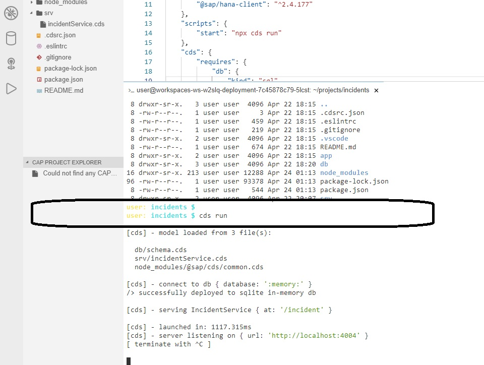
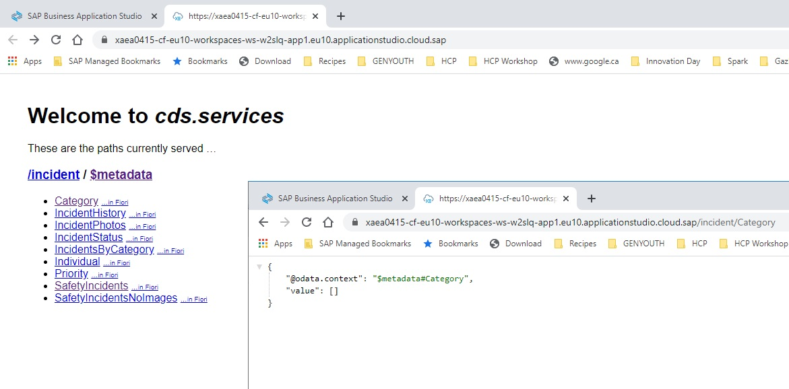
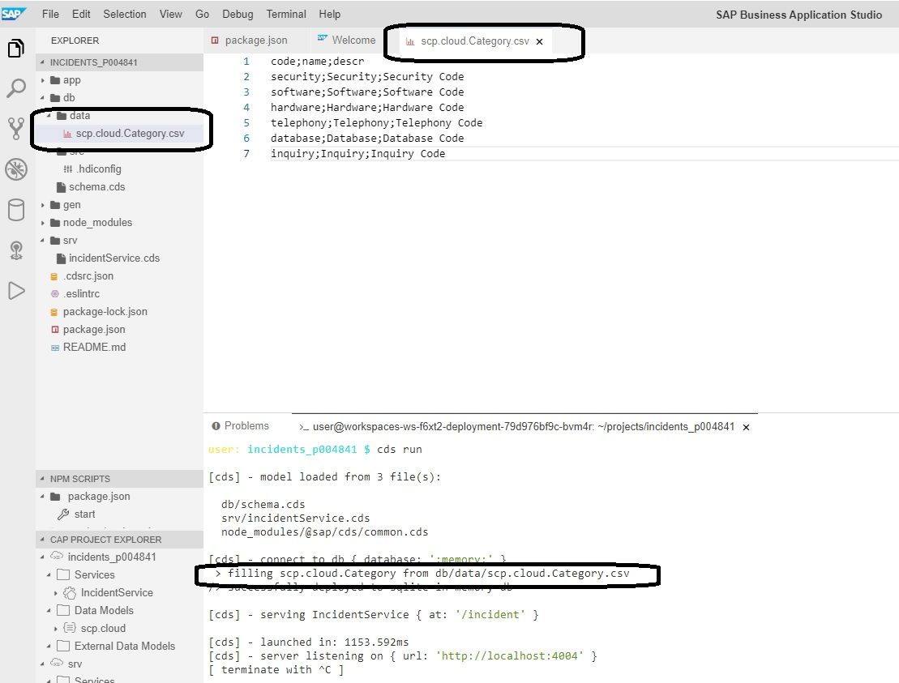
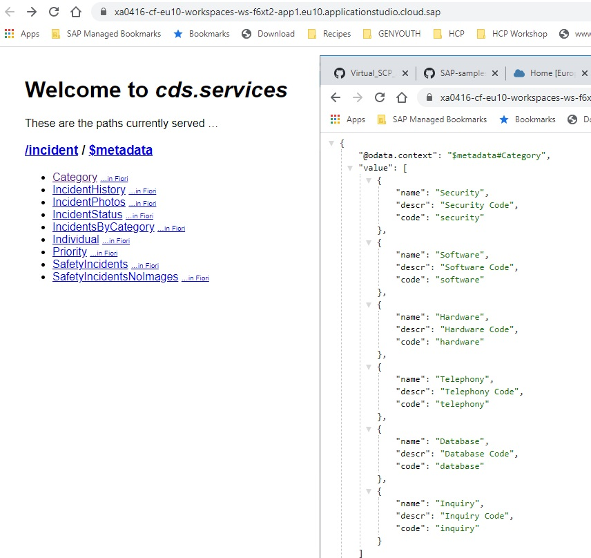

## Database Installation Time
Now, we will put a database behind our service so that we can insert and retrieve records. 
From a terminal window, ensure that you are in the incidents directory as can be seen in the following screenshot.
The first thing we will do is modify the "package.json" file so that instead of "kind" being set to "hana", we will change it to "sql". 
This is a little trick that tells applications running on NodeJs to use SQLite when in development and Hana when in production. We will discuss how this is indicated shortly.
Save the "package.json" file and from the terminal window, try executing the "CDS RUN" command as in the screenshot, you should see it complain about the fact it cannot find the module "sqlite3".

So, from the incidents directory, execute "npm add sqlite3 -D". This will install the NodeJS module for Sqlite.

Now that we have the SQLite module install, we should be able to run the "CDS RUN" command again from the terminal window and the CDS project should find, connect and run using SQLite as the following screenshot indicates:

Now we can open the application and select one of the entities. Previously, this would have failed but now you should be able to select an entity like the Category and get a response. It's empty because we have not added any rows but it does return an result set, it just happens to have no rows.

So now that we have a database running, lets add a couple of rows to the category table so that we know for sure it's running as expected. CAP has embedded in it the abilty to automatically upload rows into the database provided they are in the right place and the file has the correct structure. To that end, we will create a "data" folder within the "db" folder. Within that folder, you will create a file called "scp.cloud.Category.csv" with the following entries.

# scp.cloud.Category.csv
    
    code;name;descr
    security;Security;
    software;Software;
    hardware;Hardware;
    telephony;Telephony;
    database;Database;
    inquiry;Inquiry;
    
Double check as per the screenshot that you have the right spelling under the db folder and that the file is spelt correctly and last but not least, that the column names are correct in the actual csv file.

 When you have all those items in place, go back to the terminal window and stop the existing CDS process if it's running with "CTRL-C" and start it again with "CDS RUN". The key thing to look for when you run the "CDS RUN" command is the section towards the bottom that is highlighted that indicates "filling scp.cloud.Category"...if you see that, you know that all is good and your entity should now have some category codes in it.
 
Now that's it running, you can open the service and click on the Category entry, you should see the following:

Now we will do the same thing for three other tables, in the same folder (aka db/data), create the following files:
- scp.cloud.IncidentStatus.csv
- scp.cloud.Individual.csv
- scp.cloud.Priority.csv

# scp.cloud.IncidentStatus.csv

    code;name;descr
    new;New;An incident that has been logged but not yet worked on.
    assigned;Assigned;Incident has been asssigned to a technician
    in progess;In Progress;Case is being actively worked on 
    on hold;On Hold;Incident has been put on hold
    resolved;Resolved;Resolution has been found
    closed;Closed;Incident was acknowleged closed by end user

# scp.cloud.Individual.csv
    ID;firstName;lastName;emailAddress
    067460c5-196c-4783-9563-ede797399da8;Scott;Dillon;scott.dillon@sap.com
    efec3e9f-ceea-4d17-80a7-50073f71c322;Mark;Michaud;mark.michaud@sap.com

# scp.cloud.Priority.csv
    code;name;descr
    low;Low;
    medium;Medium;
    high;High;
    critical;Critical;

Now that all of the csv files have been created and placed in the "data" directory, we need to re-run the startup process which will in turn load the various csv files. If there is already a process running in the terminal window, stop it with "CTRL+C". Once it stops, just rerun the command cds run. You should in the console that 4 csv files have been loaded.

If you see the "filling scp" command 4 times on your screen like you do in mine, this is good news. You can open the service one last time and click on any of the 4 entities you just uploaded data into and you should see that data. If you don't see data, double check that the name of the flat file is exactly the name of the entity in question.

Now that you have the backend services running on SQLite in a local environment, it's time to get this project running on Hana in the CLoud.

[Next Exercise](Part4%20-%20Deploy%20to%20CF.md)
