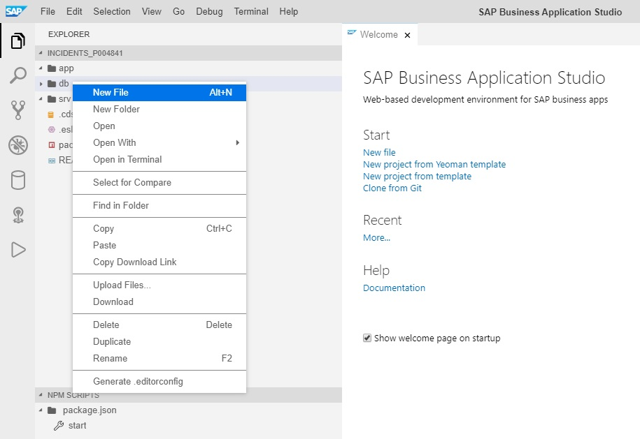
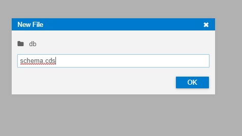
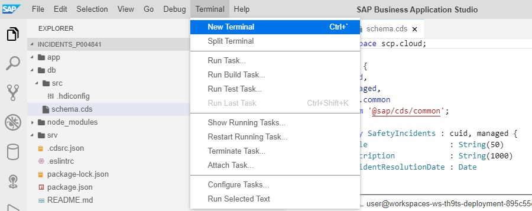
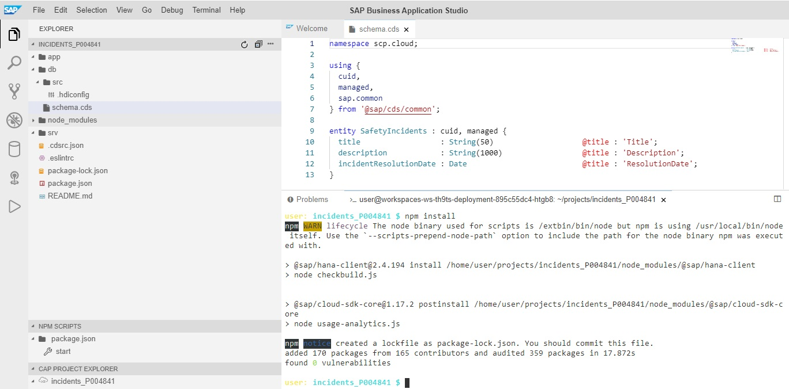
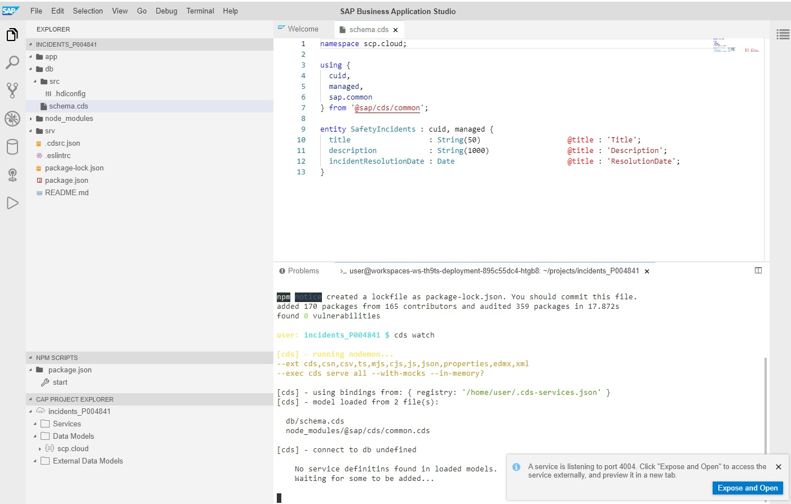
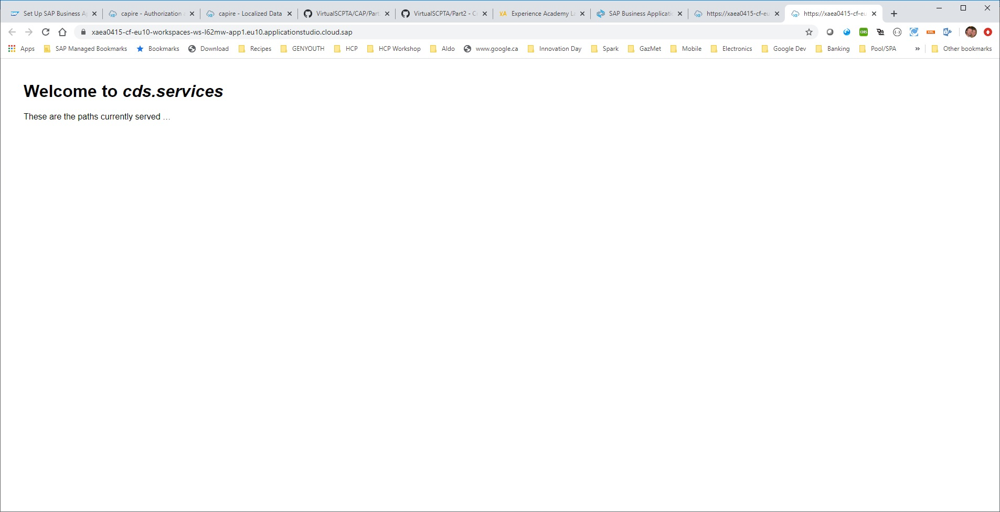
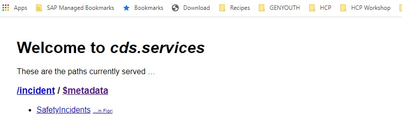
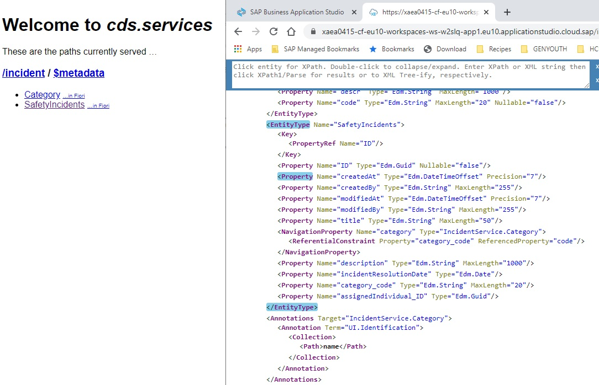
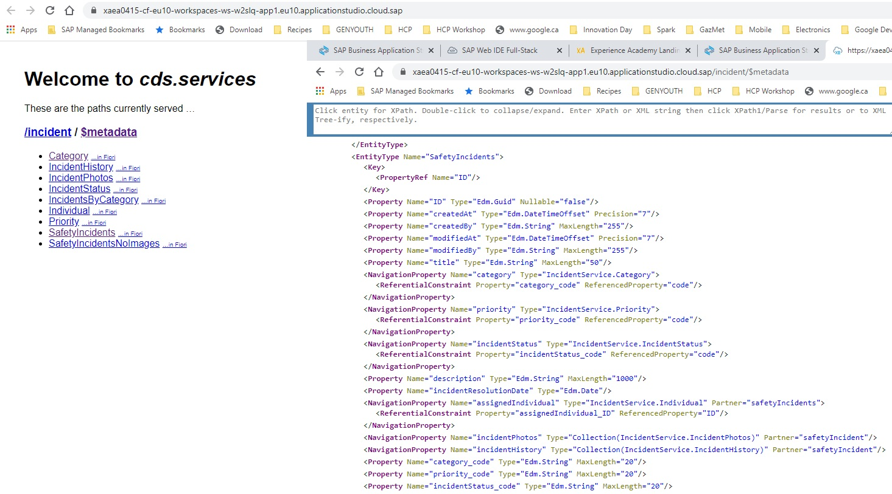

## YOUR FIRST CAP PROJECT....WOOHOO

## Before we start...just a little reminder...as you make your way through the exercises, you might find that we ask you to view the running service by opening a window. Sometimes the link will disappear and when it does, do the following to reopen it

Essentially, from the BAS Menu, you will follow View -> Find Command -> Ports for a list of applications running on ports. In our case, there should only be one listed, so just click on it to open the currently running application which should be your NodeJS application running with the service you have defined above.

## Now on with the exercise but refer back to this little hint if you are asked to view your service but can't remember how.

From the File Structure on the left, you will navigate to the DB folder and you will create a new file called schema.cds
The name of the file can theoretically be anything but for consistency, use the name we suggest so future copy/pastes will work.

 
     

From here, you will use the name "schema.cds". 

Within the file, you will now type in/copy paste the following Syntax to create your first CAP Structure:

    namespace scp.cloud;

    using {
      cuid,
      managed,
      sap.common
    } from '@sap/cds/common';

    entity SafetyIncidents : cuid, managed {
      title                  : String(50)                    @title : 'Title';
      description            : String(1000)                  @title : 'Description';
      incidentResolutionDate : Date                          @title : 'ResolutionDate';
    }

Once you have typed in that code and saved the file, it should look like the following:

Now before we go any further, we will execute a Node JS command to ensure we have everything we need installed before we continue. Open a terminal window by going to the Top Menu and selecting Terminal -> New Terminal
 
You will see a new Terminal window appear in the bottom half of the screen. 

Within the new terminal window, you will execute the command 

`npm install`

*Note -> in order for the command "npm install" to work properly, you need to ensure you are working within the correct directory. In our case, the name of the directory should be "incidents_p00XXXX". Validate that on the command line, you see "incidents_p00XXXX" as your current folder/structure. If not, change to that directory with the "cd incidents_p00XXXX" command so that you change into the proper directory (Of course XXXX is your specific userid).*

Now that you are in the correct directory, we will execute 
    

`npm install`

    

Now we will introduce you to a very useful command **cds watch**.

Enter **cds watch** in the terminal window and press return. As long as that command is running, each time you change the project structure, it will automatically save and redeploy those project changes. 

Once the **cds watch** command is running, go into the editor and make a small change to the code to see the effect. For example, if you remove 2-3 letters from the word entity, you should see a bunch of errors almost immediately. In addition, you can also try the code completion by removing a few letters from the word entity and then pressing "Control and the Space Bar"...you should be prompted for options.

  `cds watch`

    
If you have entered the code correctly for the first part of your schema, you should now see a pop up on the right of the screen that looks like this....Click on the button that says "Expose and Open" to see if your initial empty service gets rendered in the browser window.

In the browser window, if everything went okay, you should see the following:

Essentially, what you see is not much but it is running :-) However, now that we have your entity for SafetyIncidents defined, you can go back and quite easily add a service definition to exposes this entity as an oData/Rest service. Lets do that now by creating a new file within the "srv" folder called 

`incidentService.cds`

 
Within this incidentService.cds, you will enter the following code:
****notice the first line references the schema file we created earlier****

    using scp.cloud from '../db/schema';

    service IncidentService {
  
        entity SafetyIncidents as projection on cloud.SafetyIncidents;
    }

Now we are getting somewhere and after saving, you should see a screen similiar to the following one below. 
Notice at the bottom of the screen in the terminal window it now says serving IncidentService at { : '/incident}, on the right side of the screen, click the Popup to "Open in New Tab".

If your service is running properly, you will now see your first service exposed as Rest/oData.
 
You will see the reference to /incident as mentioned above and you will see a link to the $metadata. Click on the $metadata to see the definition of your entity as specified in the "schema.cds" file above. However, you should also see additional fields such as "createdBy", why are they there? Take a quick peak around within this file and notice that a large number of annotations have also been added to this file. At this point, we now have a running service which you could easily give to a UI5 developer and have him/her start developing a UI and all of this with a very minimal amount of code. We still have much to do, we will now flush out our model with some additional attributes and relationships.

Relationships between different artifacts form the core of any working application. Now we will beef up our model a little bit and add a few "assocations" to see how these are implemented. Replace what is currently in schema.cds with what follows. If your **cds watch** command is still running, you should see it get busy and eventually provide a link to click to see the new structure:

****Replace your existing schema.cds with the following code****

     namespace scp.cloud;

    using {
      cuid,
      managed,
      sap.common
    } from '@sap/cds/common';

    entity SafetyIncidents : cuid, managed {
      title                  : String(50)                   @title : 'Title';
      category               : Association to Category       @title : 'Category';
      description            : String(1000)                  @title : 'Description';
      incidentResolutionDate : Date                          @title : 'ResolutionDate';
      assignedIndividual     : Association to Individual;
    }

    entity Individual : cuid, managed {
          firstName       : String @title : 'First Name';
          lastName        : String @title : 'Last Name';
          emailAddress    : String @title : 'Email Address';
          safetyIncidents : Association to many SafetyIncidents
                          on safetyIncidents.assignedIndividual = $self;
    }

    entity IncidentsCodeList : common.CodeList {
      key code : String(20);
    }

    entity Category : IncidentsCodeList {}

Once that code is in place and if your *cds watch* is still running, you should see the following:

Again, you should be prompted with a pop-up box to open the service in a new window. (If not, refer to instructions at the top of page)
When the window opens below, you should see the service as defined on the left side of the screenshot and when you click on the $metadata, you should see the details of the service as depicted on the right side of the screenshot below.

Do you see anything missing? In our schema, we clearly defined a relationship between SafetyIncidents and Individuals but yet, it does not appear in the model as exposed by the oData services?

This is because we did not expose the Individual Entity as part of the service definition. 
Simply replace the existing contents of your existing incidentService.cds file with the following code:
using scp.cloud from '../db/schema';

**** Something to ponder...why do we see the Category Code Table exposed...it's not in the service file ****

    using scp.cloud from '../db/schema';

    service IncidentService {

      entity SafetyIncidents as projection on cloud.SafetyIncidents;
      entity SafetyOfficers as projection on cloud.Individual;
    }
Save the file...a shortcut is "CTRL+s" and wait for the CDS Watch window to prompty you for the running service.

You should now see the following:

Notice that as part of the service name I have changed the name of the entity so that when it is exposed, it will be seen to external consumers as "SafetyOfficer" and not Individual.

**A few other really important things to notice here:**
- Look in the SafetyIncident Entity, you should see a Navigation Property called "assignedIndividual", this is really important because this allows us to retrieve via oData the Individual (aka..SafetyOfficer) that has been assigned to this incident.
- Also in the SafetyIncident Entity, you should see a Navigation Property called "category". This allows us to get the details from the Category code if we need them.
- Look in the SafetyOfficers Entity, you should also see a navigation to safetyIncidents. Why do we need this? What if we wanted to retrieve a list of all incidents assigned to a certain person? Now we have forward navigation from the incident to the assigned person and back navigation from the person to all of the incidents assigned. We will see this a little later.
- I changed the entity above to SafetyOfficers just for illustration and we won't keep it going forward. But it's important to recognize that the backend entries and how they are named have no bearing on how you decide to expose them as part of the service. This also applies to the fields you choose to expose as part of the entity or choose not to expose. Perhaps you need a mobile specific service with a smaller footprint?

# Adding the last changes to the schema and service
Please replace the existing schema.cds with the following code snippet. Take a quick glance at the following declaration. You will see serveral new associations, we have an association between SafetyIncidents and IncidentPhotos as an example. We have several additional code tables. We also make use of a structure called common.CodeList. 
What effect do the two keywords managed and cuid have on your structure?
## Replace your schema.cds file with the following Code
     namespace scp.cloud;

     using {
       cuid,
       managed,
       sap.common
     } from '@sap/cds/common';

     entity SafetyIncidents : cuid, managed {
       title                  : String(50)                   @title : 'Title';
       category               : Association to Category       @title : 'Category';
       priority               : Association to Priority       @title : 'Priority';
       incidentStatus         : Association to IncidentStatus @title : 'IncidentStatus';
       description            : String(1000)                  @title : 'Description';
       incidentResolutionDate : Date                          @title : 'ResolutionDate';
       assignedIndividual     : Association to Individual;
       incidentPhotos         : Association to many IncidentPhotos
                                  on incidentPhotos.safetyIncident = $self;
       incidentHistory        : Association to many IncidentHistory 
                                 on incidentHistory.safetyIncident = $self;
     }

     entity Individual : cuid, managed {
           firstName       : String @title : 'First Name';
           lastName        : String @title : 'Last Name';
           emailAddress    : String @title : 'Email Address';
           safetyIncidents : Association to many SafetyIncidents
                               on safetyIncidents.assignedIndividual = $self;
     }

     entity IncidentHistory : cuid, managed {
       oldStatus : Association to IncidentStatus @title : 'OldCategory';
       newStatus : Association to IncidentStatus @title : 'NewCategory';
       safetyIncident : Association to SafetyIncidents;
     }

     entity IncidentPhotos : cuid, managed {
       @Core.IsMediaType : true imageType  : String;
       @Core.MediaType   : ImageType image : LargeBinary;
       safetyIncident                      : Association to SafetyIncidents;
     }

     entity IncidentsCodeList : common.CodeList {
       key code : String(20);
     }

     entity Category : IncidentsCodeList {}
     entity Priority : IncidentsCodeList {}
     entity IncidentStatus : IncidentsCodeList {}

## Replace your incidentService.cds with the following code
    using scp.cloud from '../db/schema';

    service IncidentService {
    
    entity SafetyIncidents as projection on cloud.SafetyIncidents {*,assignedIndividual: redirected to Individual };
    
    entity Individual as projection on cloud.Individual {*,safetyIncidents : redirected to SafetyIncidents};

    entity SafetyIncidentsNoImages as projection on cloud.SafetyIncidents{ID ,createdAt, priority, incidentStatus,description};

    entity IncidentPhotos as projection on cloud.IncidentPhotos {*,safetyIncident : redirected to SafetyIncidents};

    entity IncidentHistory as projection on cloud.IncidentHistory {*,safetyIncident : redirected to SafetyIncidents};

    entity IncidentsByCategory as select from cloud.SafetyIncidents {count(ID) as categories:Integer,key category} Group By category;
    
    @readonly entity Category as projection on cloud.Category;
    @readonly entity Priority as projection on cloud.Priority;
    }

Please ensure that both files are saved and if the **cds watch** command is not already running in the terminal window, now would be a good time to restart it.

From the Business Application Studio, open the incidentService.cds file, your final service definition should look like this:

Now it's time to check the schema and verify that it contains everything you exposed via the serviceIncident.cds file. Just a reminder, if you don't see the link on the side to open the link in a Tab, use the procedure outlined above to find the open ports and open the running appliation this way.

# Congratulations....you have completed the schema for the Incident Management Application..

Now we must associate the application with a database so that we can actually store records.

[Next Exercise](Part%203%20-%20SQLite.md)

