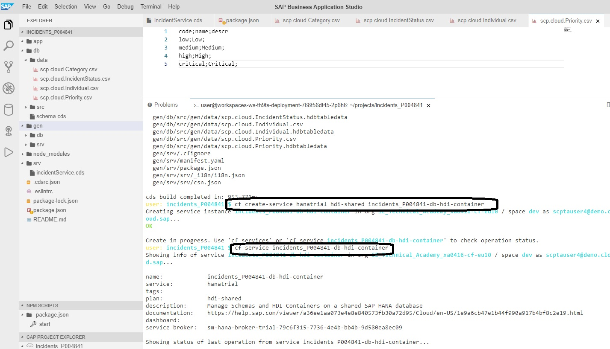
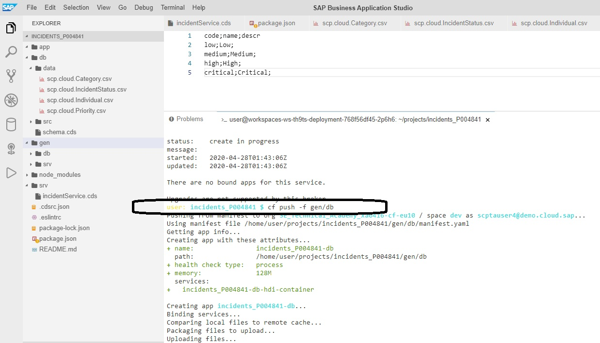
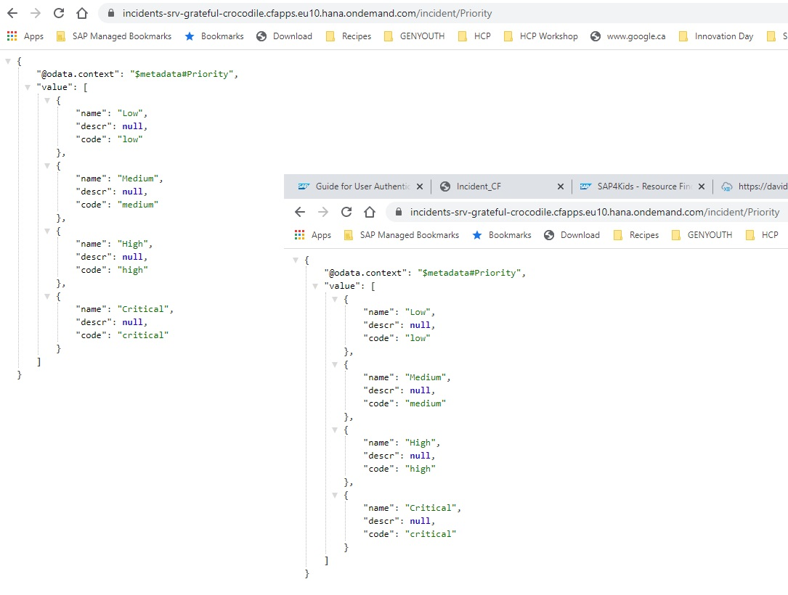

# Don't continue here unless you have successfully completed the last 3 sections

## Quick Recap
- A schema for the incident management application has been created "schema.cds"
- A service definition has been added to expose the correct entities "incidentService.cds"
- The Sqlite node module was installed that let us run the application connected to sqlite with data loaded into 4 tables

## Now we will go through the steps to deploy and run this NodeJS application on Hana in Cloud Foundry

Within the NodeJS world, there is an environment variable called NODE_ENV and the default in the cloud is has the value set to "production". In our environment we will now set that variable to production and it will affect the way that certain aspects of CDS will behave. The following command must be run from the Terminal Window. Stop your running cds process with CTRL+C if it's already running on execute the following from the terminal window:

`export NODE_ENV=production`

After this command runs successfully, you will execute from the same terminal:

`cds build/all --clean`

This command will build all of the relevant Hana artifacts and place them in a newly created folder that you should now see called "gen". If you expland it, you should see 2 folders DB and SRV. As you might expect, if you drill into the DB folder, you will see the Hana DB artifacts and if you drill into the SRV, there are new files in there as well.

Once the build process has completed, you will now execute 3 commands in succession in order to create the Hana HDI container on Cloud Foundry, deploy the Hana Artifacts and the SRV Artifacts. If you notice the very last line in the above screenshot, the build process actuall tell us what command we need to run in order to create the hdi container. We will modify it slightly to use the hanatrial schema environment but the rest is the same.

Execute the following command:

`cf create-service hanatrial hdi-shared incidents_p00XXXX-db-hdi-container`

*As you can see from screenshot above, it's providing a link based on my project name that has my ID in it....be sure to look for this line and be sure it matches when you create the hdi container. If you don't use the correct name, the next 2 steps will likely not work *

This will create a hana container called "incidents-p00XXXX-db-hdi-container"

Next to execute:

`cf push -f gen/db -k 256M`

The HDI instance creation might take a couple of minutes, so if you see an error saying "An operation for service instance incidents_p00XXXX-db-hdi-container is in progress" just wait a couple of seconds and retry.

Next to execute:

`cf push -f gen/srv --random-route -k 256M`

If all three of the last commands executed correctly, you should see a route specified towards the bottom of the terminal window. The use of the word option --random-route directs the process to essentially create a random URL which is why I can't tell you exactly what it will be. However, take a look in the screenshot for the following Route: 

**incidentsp00XXXX-srv-persistent-leopard.cfapps.eu10.hana.ondemand.com**

Once you find the route name that was generated uniquely for you (Cloud Foundry will generated some interesting names), you should be able to paste that URL into a browser and see the application and validate that it is running as it is now running and available on the internet.

Open a web browser, paste your newly created route and you should see a familiar screen that looks like this. Click on one of the entities that you have loaded data into. In my case, I selected Priority. This fully deployed service is now available on the internet and using Hana as a persistence layer. Not bad for 60  minutes of work :-)

## CONGRATULATIONS...You have survived Week1 and have built your first CAP Application using NodeJS...See you Next week.
