# Integrating the Safety Incident Components

In this section, we will;
* Introduce you to the following services from SAP Cloud Platform;
  * Enterprise Messaging, 
  * Serverless Functions, 
  * Integration Service 
* Discuss how these services will be used by the Safety Incident application

Note: There are no steps to configure or code in this section. 
* However show you how we have configured Message queues, topics and serverless functions.
* This section is intended to provide a common understanding of key terms and provide a common understanding

**If you would like to proceed with the hands-on exercise, continue to the bottom of this section and click "Next"**.

# Which SCP Services will be used by the Safety Incident Service

This exercise will be based on a loosely coupled integration architecture and will leverage the following SCP integration services 
* Enterprise Messaging
* Extension Factory, Serverless Runtime
* Integration Service 

## Enterprise Messaging 

The SAP Cloud Platform Enterprise Messaging service is used to connect applications, services, and systems across different landscapes.

SAP Cloud Platform Enterprise Messaging is a fully managed cloud service that allows applications to communicate through asynchronous events and seamlessly extend your digital core. It helps create responsive applications that work independently and participate in event-driven business processes inside your company.

SAP Cloud Platform Enterprise Messaging employs a centralized message-oriented architecture. It is more scalable and reliable compared to the traditional point-to-point communication models.

The service supports the following messaging and eventing concepts:

#### Queues

The service enables applications to communicate with each other through message queues. 

A sending application sends a message to a specific named queue. There's a one on one correspondence between a receiving application and its queue. 

The message queue retains the messages until the receiving application consumes it. 

For the Safety Incident scenario, there are 2 loosely coupled consumers "receiving applications";
1. A serverless function which will be used to create an instance of the user workflow 
2. An SCP Integration Flow which will store the incidents as files on an SFTP server

**You will be implementing the 2nd scenario as part of this exercise**

Each of these receiving applications will be listening on a specific queue

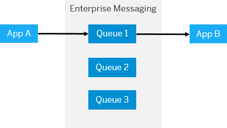

#### Topics 

The service enables a sending application to publish messages and events to a topic. 

The receiving application must be subscribed to that topic and be active when the message is sent. Topics do not retain messages. 

This method can be used when each message needs to be consumed by a number of receiving applications. 

```
For the Safety Incident scenario, the "receiving applications" will not subscribe to topics
This method is not used by the Safety Incident application
```

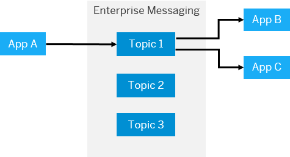

#### Queue Subscriptions

In queue subscriptions, the service enables a sending application to publish messages to a topic that directly sends the message to the queue to which it is bound. 
* A queue subscription ensures that the message is retained until it is consumed by the receiving application.

For the Safety Incident scenario, we will use 2 queues. 1 of the queues has been preconfigured to for our Function As A Service and the other queue will be created as part of the exercise. Each of these queues will subscribe to a topic. 

As Incidents are created via the mobile application or the UI5 application, the CAP application will emit/publish events via AMQP with a certain topic. Once published, they will be deposited into the relevant queues depending on the subscription.

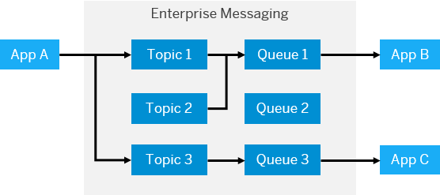

#### Message Protocols and Libraries 

The following protocols are supported:
* **Advanced Message Queuing Protocol (AMQP) 1.0 over WebSocket**
  * It is an open standard protocol used for messaging between applications or organizations. We recommend that you use AMQP 1.0 over WebSocket for messaging between applications running on Cloud Foundry. 
* **Message Queuing Telemetry Transport (MQTT) 3.1.1 over WebSocket**
  * It is a lightweight messaging protocol designed specifically for constrained devices, low bandwidth, high latency, or unreliable devices. We recommend that you use MQTT 3.1.1 over WebSocket for messaging to a service from applications not running on the Cloud, for example, S/4HANA. 
* **REST APIs for Messaging**
  * The service provides REST APIs for messaging. You can use these messaging REST APIs to send and receive messages.
  * For more information, see [REST APIs for Messaging](https://help.sap.com/viewer/bf82e6b26456494cbdd197057c09979f/Cloud/en-US/6a0e4c77e3014acb8738af039bd9df71.html).

```
For the Safety Incident scenario, you will see how;
- the CDS service publishes the event to the Enterprise Message service via HTTP
- The function as a service uses AMQP to listen to the Queue. 
- When an incident is created the function will then create the workflow via HTTP  
- The Integration Flow is configured to listen to the Queue using AMQP. 
- When an incident is placed in the IFlow Queue, the IFlow will be automatically triggered
```

For more information see, [Enterprise Messaging](https://help.sap.com/viewer/product/SAP_ENTERPRISE_MESSAGING/Cloud/en-US)

## Serverless Functions 

The SAP Cloud Platform Extension Factory, Serverless runtime service lets you build, run, and manage serverless applications. 

A Serverless extension allows you to write loosely coupled business logic that is quick to build and scales automatically. 

You can also use Serverless functions to receive and respond to events across the SAP Cloud Platform and external event sources to validate data, process files, and send notifications. Along with these functions, you can create triggers that invoke the function, for example, a time-based trigger can schedule recurring activities such as reporting and cleanup jobs.

This service runs in the Cloud Foundry environment.

```
For the Safety Incident scenario, SAP has deployed a serverless (NodeJS) function which is listening 
on the workflow queue. 

The queue is called sap/vr/A/WorkflowQueue. 

There is only one for all of the users so as the incidents are created, they will all be placed in this queue. 

When Safety Incidents are created and published to the Enterprise Messaging service, 
the function will pick up the incident and create a workflow instance by calling your workflow. 

You can then go to your inbox to see your Safety Incident.
```

For more information see, [SAP Cloud Platform, Extension Factory Serverless Runtime](https://help.sap.com/viewer/product/XF_SERVERLESS_RUNTIME/Cloud/en-US)

# What does this mean for Safety Incident Integration

The goal of this exercise is to trigger a workflow and save the incident to a file when the incident is created.

Lets look at the landscape for user P004042 to understand how it is setup.

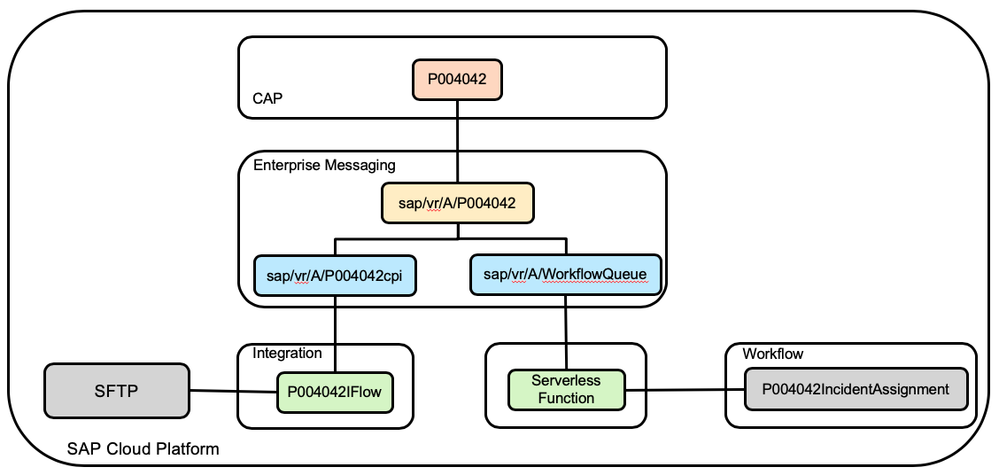

You will notice that:

* The CAP service has been modified to publish an event ot the enterprise message service. 
 * It will publish to a topic containing the user ID (i.e. for user sap/vr/A/P004842P004842)
 
* The Service will publish to the following topic **sap/vr/A/***
  * This topic has been configured to accept all messages, as long as it follows the namespace prefix **sap/vr/A/**

* There are two queues 
  * **sap/vr/A/P004842cpi**
    * This queue will be used by the SCP Integration Service exercise
    * As messages are published to the topic, this queue will be populated. 
    * The message will have a JSON payload that includes the IncidentID
    ```
    {
      "ID":"dfd5fa26-2def-4f35-9440-58b550142ad8",
      "categoryCode":"inquiry",
      "userID":"P005145"}
    }
    ```
    * You will develop, configure and deploy your IFlow. It will listen on the queue sap/vr/A/P004842cpi for when a new message arrives.
    * The IFlow will create a file for the Incident and store it on an SFTP server
    * Each user will have their own queue
    * Once the IFlow processes the message, it will be removed from the queue

    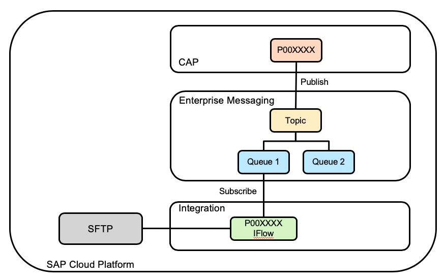

 * **sap/vr/A/WorkflowQueue**
   * The queue will be used by the serverless function to trigger your workflow
     *  As messages are published to the topic, this queue will be populated. 
     * The message will have a JSON payload that includes the Incident ID
     ```
     {
       "ID":"dfd5fa26-2def-4f35-9440-58b550142ad8",
       "categoryCode":"inquiry",
       "userID":"P004842"}
     }
     ```
  * The serverless function will call the API to trigger a new workflow and use the userID to identify your workflow
     * Remember your workflow Definiton ID uniquely identifies your workflow and looks like this P004842incidentassignment
     * We can append your user to "incidentassignment" to create your workflow 
  * Once the Serverless function processes the message, it will be removed from the queue
 
 
 
Note: Both Queues will be populated with the same incident 

## Let's take a look at the Topics, Queues and Serverless Functions on SCP

Open a New Browser Window and use the following Link

https://virtual-scp-roadshow.cfapps.eu10.hana.ondemand.com

For this scenario, we will be using Enterprise Messaging so click on the "Let's Go" within the Enterprise Messaging Tile

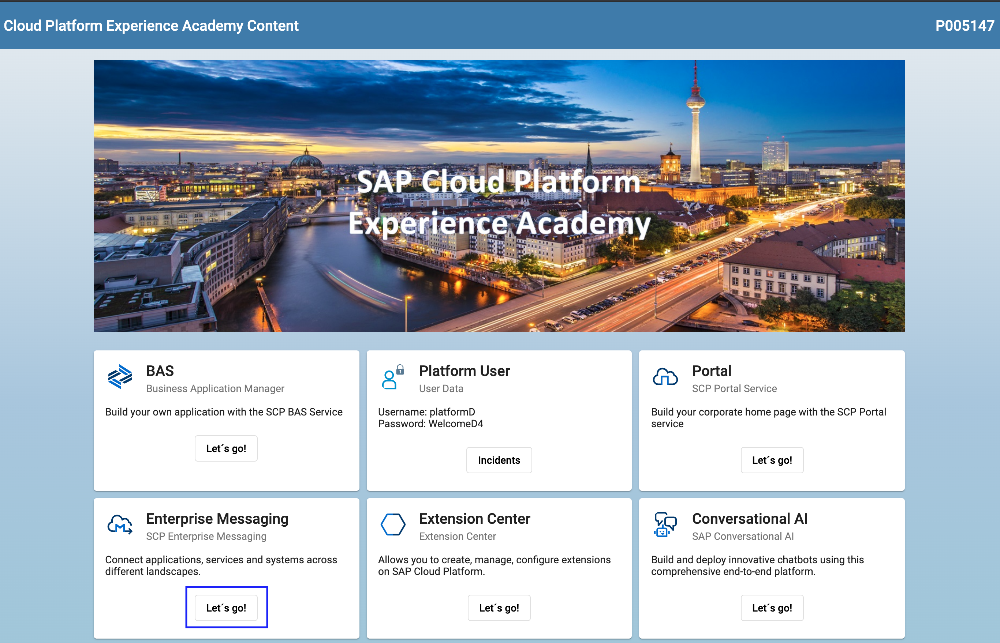

You should now see the following page 

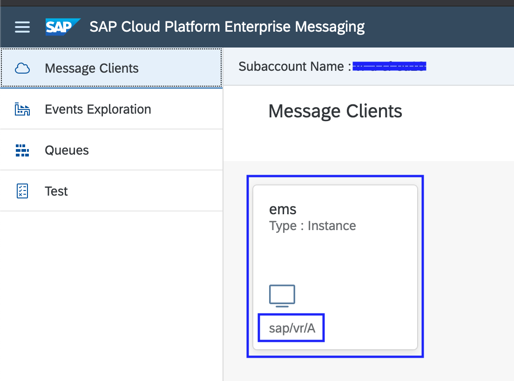

Notice :
- The name of the Enterprise Message Instance is ems
- When the Enterprise Message is created a namespace is given. The namespace for ems is sap/vr/A

Click on the instance **ems**. You should see the following tile.

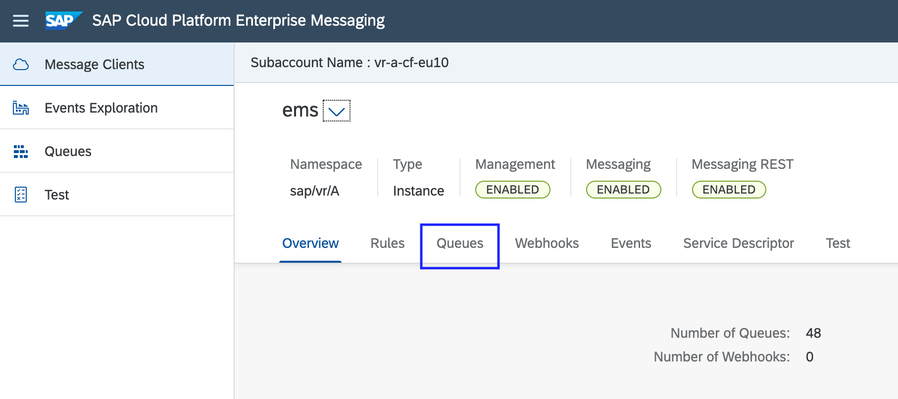

Click on "Queues" to view the queues that we have defined.

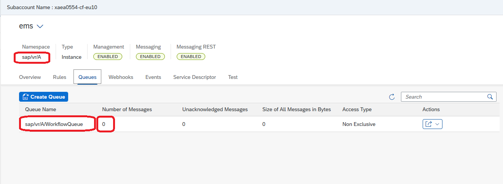

Notice the queue names **sap/vr/A/P005001cpi**, they follow the format **namespace + UserID+cpi**
 * These will be used when you develop the IFlow to create Safety Incident Files.
 
You can also see the number of messages in the queue and the number of unacknowledged messages. 
As you create incidents, you will see these numbers change as messages are entering and leaving the queue.

Remember there is a second queue, that will be used to trigger your workflow. 

To find the second queue, search for "Workflow". You will now see the **sap/vr/A/WorkflowQueue** queue. 
This queue will contain all incidents from all users and will be used to create the workflows.


## How to find topics

You have seen the Enterprise Message Queues. 

Now lets look at the topic which both of the queues are subscribed. 

On the far right-hand side, click "Action" and then "Queue Subscriptions"

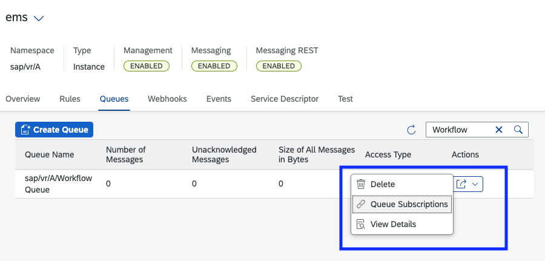

We notice the following
* The topic name: sap/vr/A/*
* The name of the queue: sap/vr/A/P005001cpi

 ```
 Try to find your cpi queue and make sure the topic the same as the one listed above
 Check the Workforce queue and look for the subscribed topic - it should also be the same as the one listed above
 ```
 
The topic will be used by the CAP service to publish messages to the Enterprise Message Service. 
* The messages will be published to a topic and not to a specific queue. This way it is easy to add new consumers. 
  *The safety incident application will continue to publish to the topic - All we have to do is create a new queue and subscribe to the topic.
  
## How to test in the Enterprise Messaging User Interface 

When you are designing decoupled event driven architectures like this one, it helps to have a built-in testing tool.

On the right-hand side of the following screen. Click on "Test".

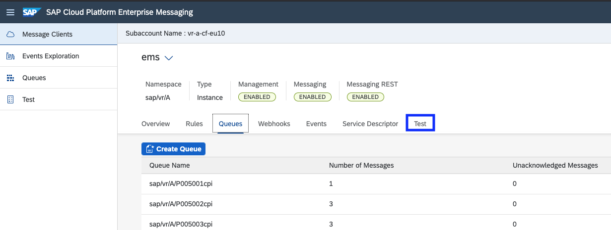

On the following page, you will see the test utility. 

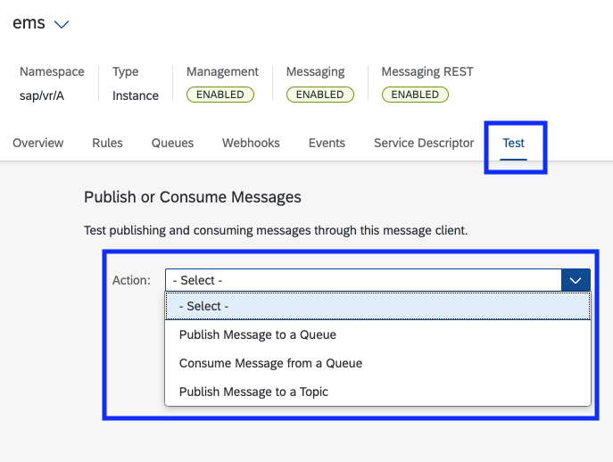

You see that you can: 
* Publish a message to a queue
* Consume a message from a queue 
* Publish a message to a topic

 ```
 For the Safety Intelligence application, both of the consumers require the Incident ID. 
 The UserID is used by the Serverless Function to create the Workflow Definition ID 
 
 The format of the payload is 
   {
     "ID":"dfd5fa26-2def-4f35-9440-58b550142ad8",
     "categoryCode":"inquiry",
     "userID":"P004842"}
   } 
 
 For this exercise, we do not recommend testing from this utility, 
 instead to use the provided UI5 test application  
 
 Note: The Incident ID must exist in your subaccount, refer to part 5 Testing. 
 This is the ID generated by the CAP service when you create an incident.
 ```

## Now lets take a look at the Serverless Function 

You have seen the queue **sap/vr/A/WorkflowQueue**. This is the queue that contains the messages to trigger workflows.
A serverless function has been deployed and is subscribed on this queue. Lets take a look at the Extension Center.

Go back to the following link https://virtual-scp-roadshow.cfapps.eu10.hana.ondemand.com
Click on the "Let's Go" in the Extension Center tile.


Now you will see the Extension Center User Interface.

### Serverless Function Code 

SAP has deployed a NodeJS function for the Safety Incident application. 

Click on the tile for the function "initiateworkflow".


You will now see the function 


A funtion is made up of certain key files like;
* faas.json 
  * You can see this is where we define the trigger and the trigger and the protocol (i.e. AMQP)
  
  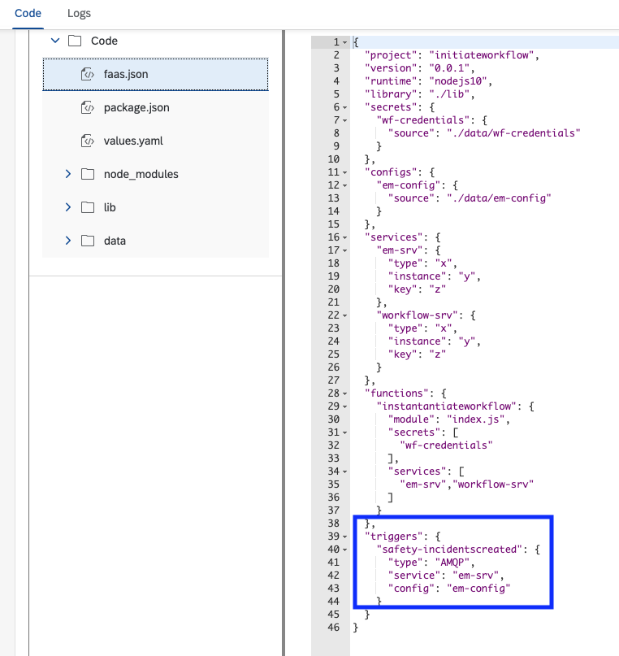

* values.yaml
  * Here you will notice the URL to invoke the workflow and the queue
  
  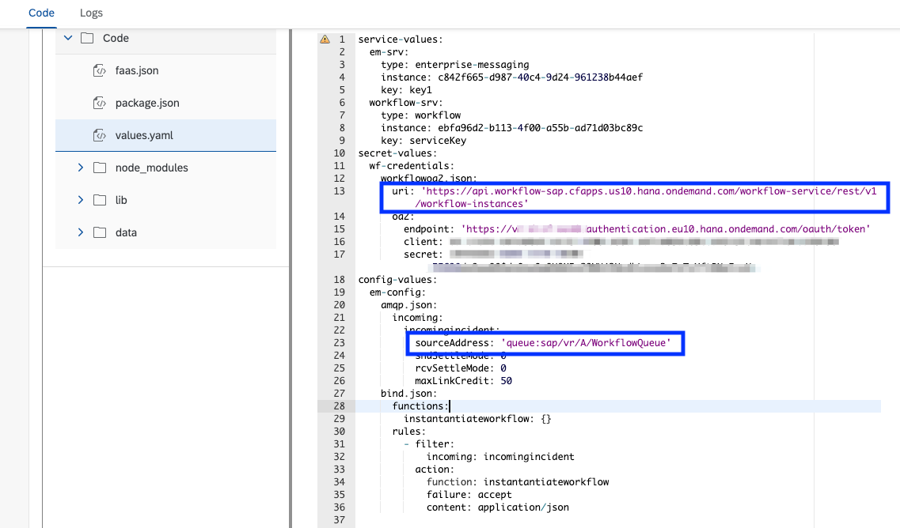

* lib/index.js
  * Here you will notice the code for the function. This is what will get executed when the function is executed
  
  

### Serverless Function Logs 

You can use the function logs to see if your safety incident was processed by the function or if there was a problem 

Click on the "Logs" tab.


You will now see the logs for the function. As the function is triggered, it will write to the logs. 

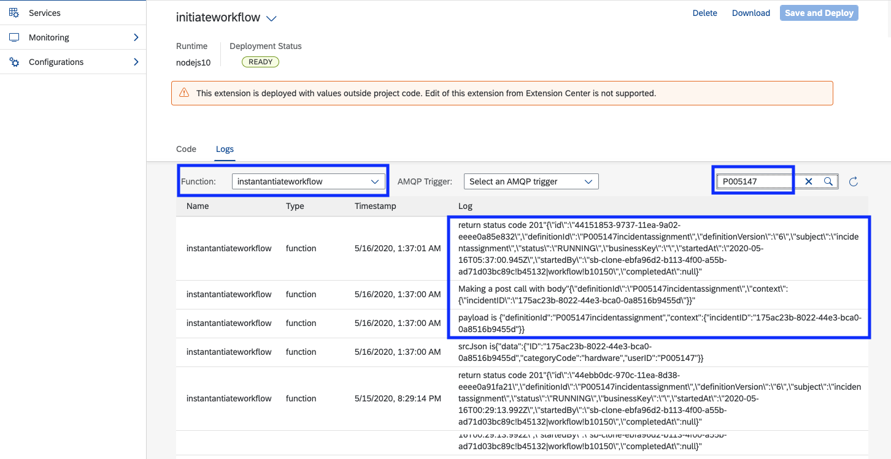

In the image above, you can search for your user ID to see your logs. You can see the payloads and event the request to trigger the workflow with a successful status equal 201.  

Now that you have the foundation for the Safety Incident Integration design, let's develop an Integration Flow that will be listening to a queue.

[Next](Part%202%20-%20SCP%20Integration%20-%20Create%20your%20iFlow.md)
