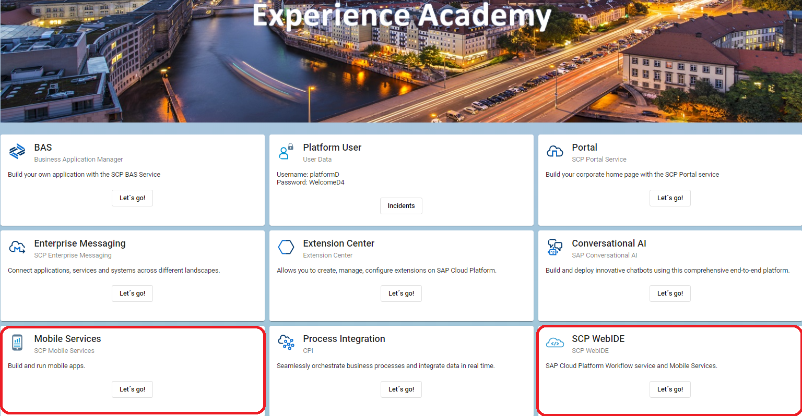
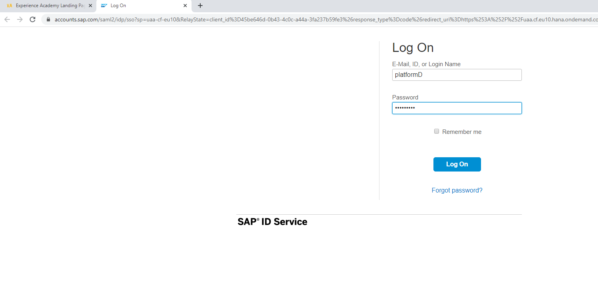
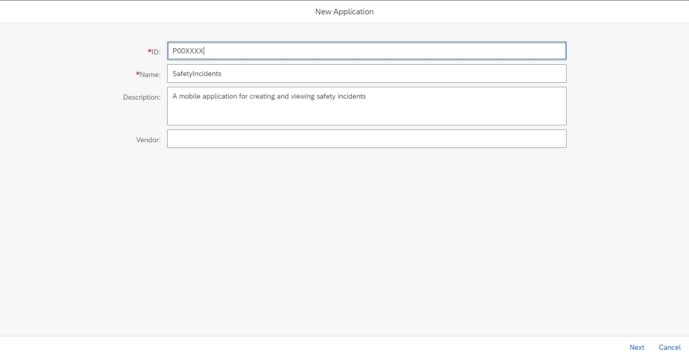
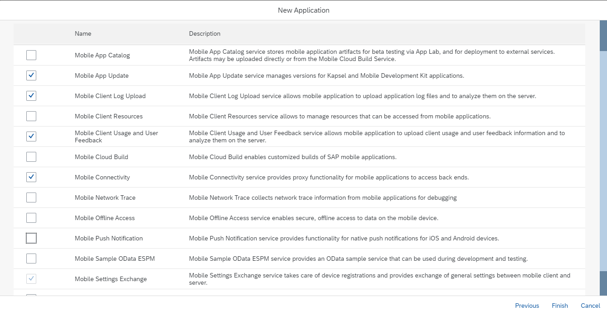
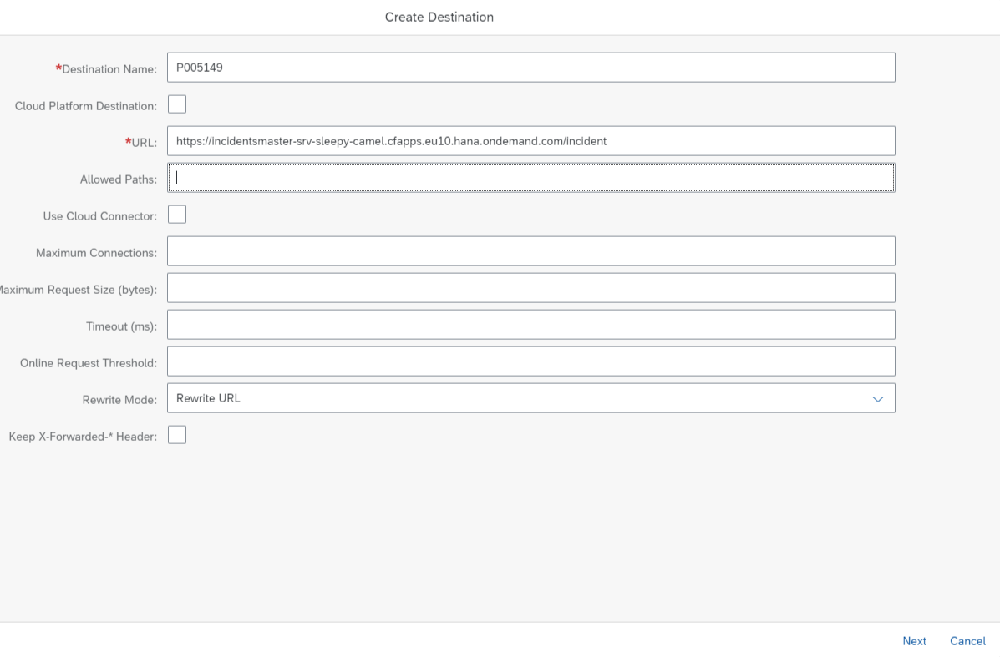
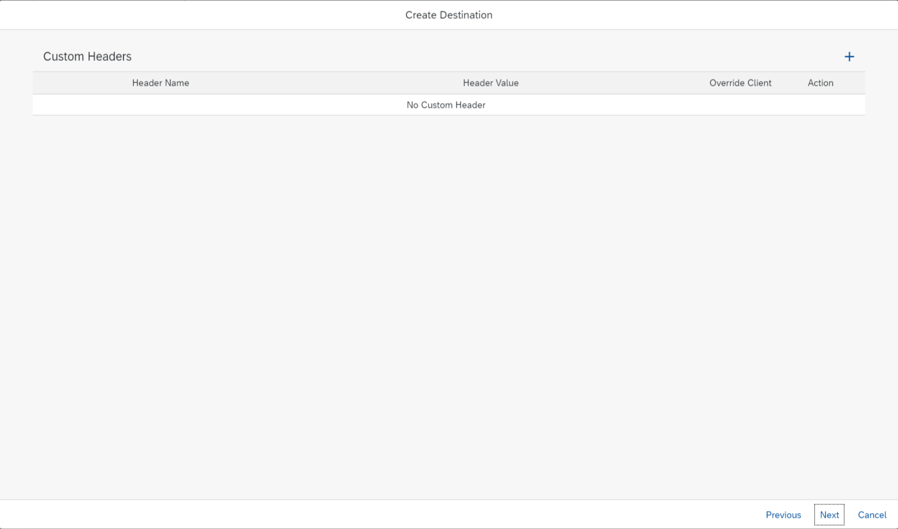
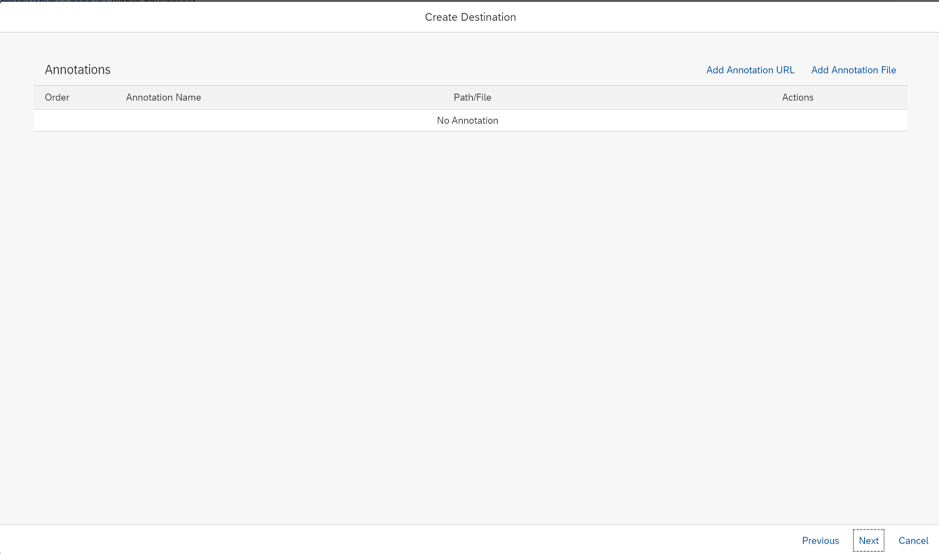
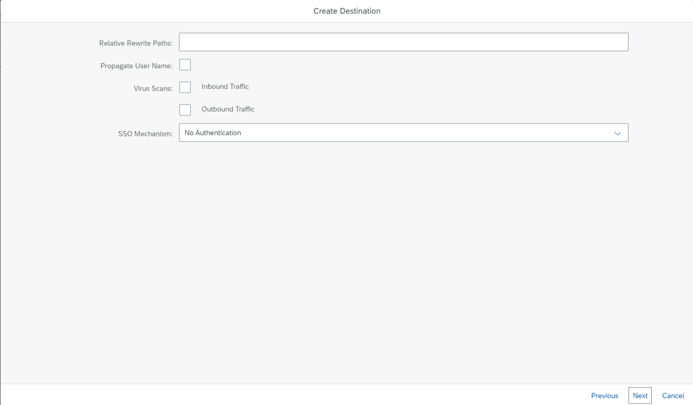
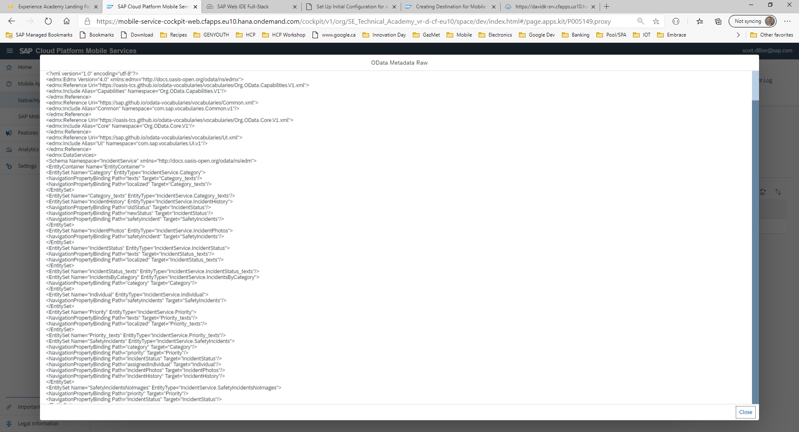
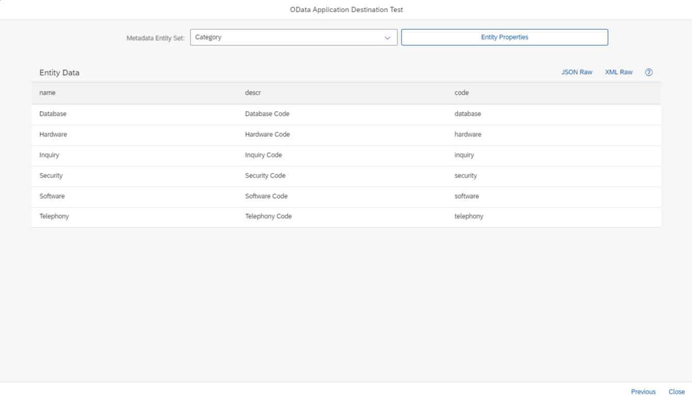

# Mobile Services Configuration

From the Launchpad, you will be using 2 icons, the "Mobile Services" and the "Web IDE". 

Mobile Services will be used to configure your application and establish connectivity to the data sources that you want to use in your mobile application.

The Web IDE will be used to build/model the mobile application that will then be deployed to SAP CLoud Platform for delivery to the device.

## Configuring Mobile Services

From the Landing page, you will select Mobile Services.

**IMPORTANT**
You have logged into your Portal as your P00XXXX number. When you log into the mobile services cockpit, it requires the platform user that corresponds to your group.

The space and org should be auto populated based on the platform user.

After you select the organization and space, the mobile services cockpit will open and you can expand the Mobile Applications folder and then select the Native/Hybrid option. You will see the default client configuration.

We are going to be adding a series of new mobile applications, one for each user. Click on "New" to start the wizard for creating a new mobile application which will be used shortly in the Web IDE.

For the configuration setup, it's very important to specify a unique name for the ID of the application. The suggestion is to use your unique userID that you have been provided. So change the P00XXXX in the screenshot to your unique userid. Once you have completed the details, click next.

    Name : SafetyIncidents
    Description: A mobile application for viewing and creating safety incidents
    

The Mobile Services offering has many features that we can automatically add to our application without additional coding. For our purpose, there are a couple that are really important for our use case. Select/deselect the options as highlighted in the screenshot. Of particular importance are the **Mobile Connectivity** and the **Mobile App Update**. If these 2 are not selected, you are destined for problems :-) Click Finish to start the provisioning of your mobile application.

You will see a screen indicating that the process will take a few seconds...just click "OK".

Once the application has been provisioned, you should see the following setup for your SafetyIncidents application and the associated assigned features.  If you don't see **Mobile App Update** and **Mobile Connectivity** under the list of assigned features, you need to edit the application and ensure these 2 are selected before you proceed.

We now need to configure the Mobile Connectivity to tell the mobile application where it should source the data for the application. It should be clear that oData services play a very important role in the delivery and connectivity of applications. We need to point our application at the service that was generated by CAP in week one. Under "Assigned Features" click on the "Mobile Connectivity" 

### Adding data connections that can be used within the app

The following screen will open and we will click on the icon hightlighted in red to create a new destination for our mobile application.

Here we only need to specify the name of the destination and the URL of the service of where to find the data. For the destination name, use your user id, **P00XXXX**

** The following is a list of the URLs that you will use, please pick the one that corresponds to your group **

    Group A: https://incidentsmaster-srv-noisy-bongo.cfapps.eu10.hana.ondemand.com/ 
    Group B: https://incidentsmaster-srv-anxious-quokka.cfapps.eu10.hana.ondemand.com/ 
    Group C: https://incidentsmaster-srv-patient-lynx.cfapps.eu10.hana.ondemand.com/  
    Group D: https://incidentsmaster-srv-sleepy-camel.cfapps.eu10.hana.ondemand.com/

For the rest of the screens seen below, just press next until you come to the end and then click Finish. The following screens are for various configurable aspects, none of which we will use such as customer headers, keystores, authentication,etc...

Change nothing...press next 

Change nothing...press next

Change nothing...press next

Change nothing...press **Finish**

**Before proceeding to the next step, we we need to ensure that our data connectivity is properly setup and working.**
This will only take about 1 minute, provided you have followed instructions closely above :-)

Simply click on the oData test icon as indicated in the screenshot:

From here, you will see a screen like below. To test connectivity and setup, you can click on the $metadata URL and you should see the service metadata being returned from the service like so:

Or if you click next, you should then see a list of the entities contained in your service as shown here:

If your configuration is correct, you should be able to select any entry in the dropdown and see the data for that entity.

If and only if you see the metadata as outlined above or see your entities and their data, proceed now to the next exercise.

**Congratulations...you have the configuration section complete...time to build a mobile application **

[Next Exercise](Part2.md)
