# Modify your SAPUI5 Application

You are now able to visualize a list of incidents and its details. In this section you will learn how to modify the application interface to make it more user-friendly as well as adding other funtionality to create new incidents.

## Step 1: Make changes to the UI

1. In Explorer, go to **IncidentReportP00XXXX > webapp > view**, right click on **Worklist.view.xml > Open with Code Editor** 

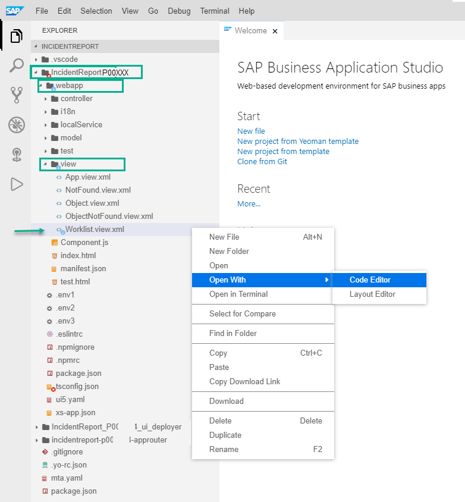

2. SAPUI5 allows to add additional oData parameters directly in the view. For this application, you need to access additional oData entities that are linked to our main entity _SafetyIncidents_, this can be done by adding the _expand_ parameter and indicating the navigation properties to be expanded.

```javascript
	parameters: {
		expand : 'incidentPhotos,category,priority'
	},
	sorter: {
		path: 'createdAt',
		descending: true
	}
```


3. Here we add some columns to the main view and its corresponding content.

Note: Please pay special attention to the _formatter_ parameter, we will be discussing it later on.

```xml
	<Column id="imageColumn" width="6rem">
		<Text text="" id="nameColumnImage" />
	</Column>
	<Column id="nameColumn">
		<Text text="{i18n>tableNameColumnTitle}" id="nameColumnTitle"/>
	</Column>
	<Column id="unitNumberColumn" hAlign="End">
		<Text text="{i18n>tableUnitNumberColumnTitle}" id="unitNumberColumnTitle"/>
	</Column>
```
```xml			
	<Image src="{path:'incidentPhotos/0/ID',formatter: '.formatter.src'}"  width="4rem" decorative="true"/>
	<ObjectIdentifier 
		title="{title}"
		text="{description}"/>
	<ObjectStatus text="{priority/name}" state="{path:'priority_code',formatter:'.formatter.state'}"/>
```		    
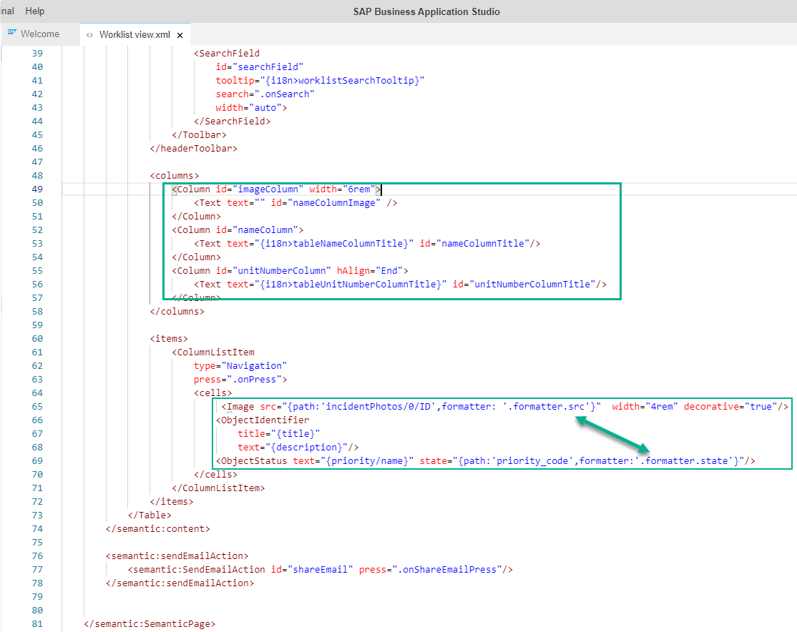

4. Open the **Object view**.

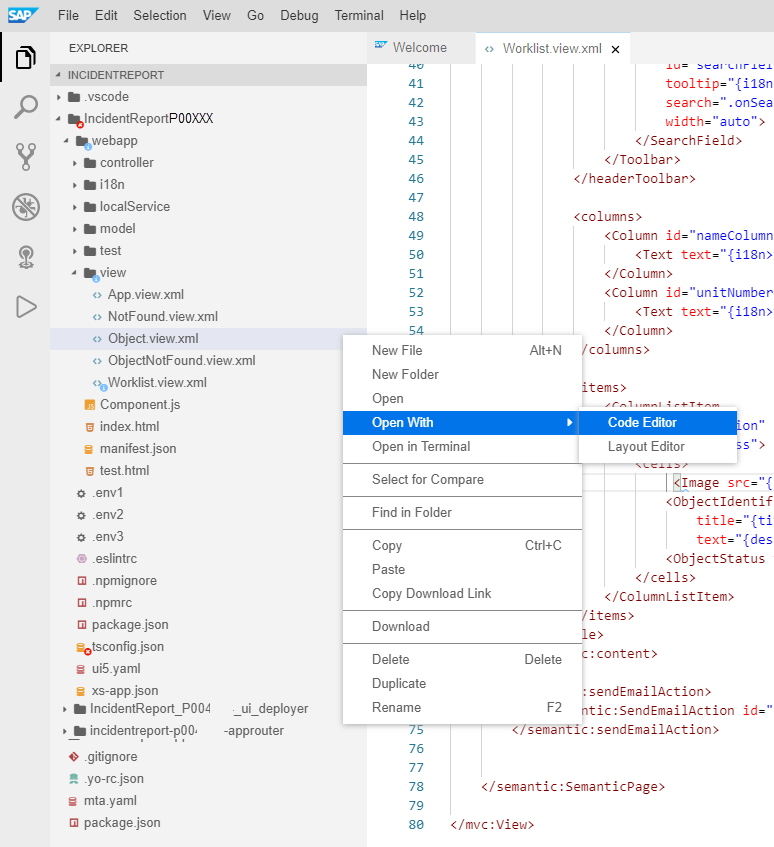

5. In the Object view, we will display more information about the selected incidet. First, we will need to add additional libraries to the view (line 6 and 7) and then modify the header visualization (lines 16 - 24).

Add before *>*:
```xml
	xmlns:core="sap.ui.core" 
	xmlns:f="sap.ui.layout.form"
``` 
Replace _titleHeading_ and _headerContent_:

```xml
	<semantic:titleHeading>
   		<Button icon="sap-icon://nav-back" press="onNavBack" type="Transparent"/>
   	</semantic:titleHeading>
	
   	<semantic:headerContent>
   		<ObjectIdentifier
		title="{title}"
   		text="{description}"/>
   	</semantic:headerContent>
```
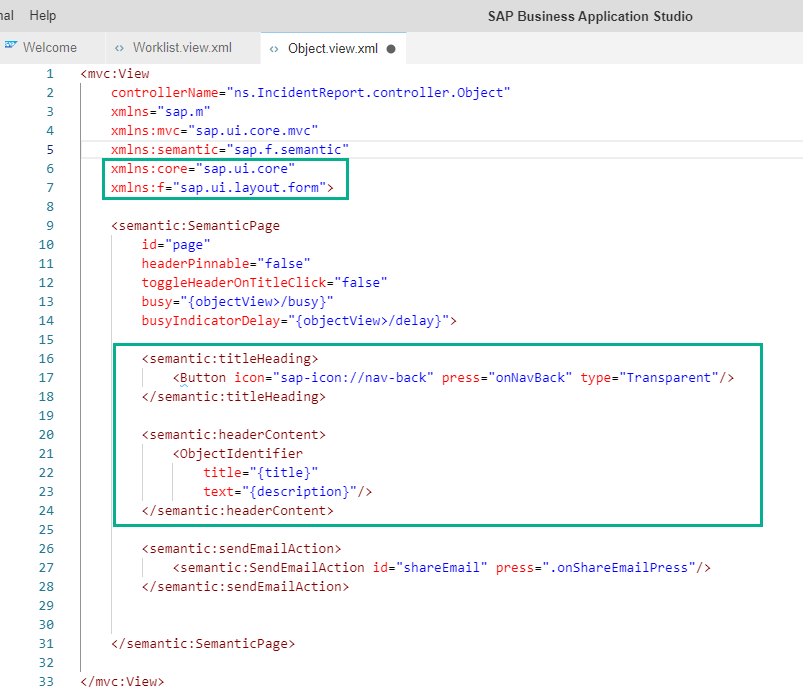

6. For the body section, you will add a form object with more detailed information about the incident.

```xml	        
	<semantic:content >
            <f:Form editable="false">
				<f:layout>
					<f:ResponsiveGridLayout backgroundDesign="Solid" labelSpanXL="12" labelSpanL="12" labelSpanM="12" labelSpanS="12" adjustLabelSpan="false"
						emptySpanXL="0" emptySpanL="0" emptySpanM="0" emptySpanS="0" columnsXL="1" columnsL="1" columnsM="1" singleContainerFullSize="true"/>
				</f:layout>
				<f:formContainers>
					<f:FormContainer>
						<f:formElements>
							<f:FormElement>
								<f:label>
									<Label text="Title" design="Bold"/>
								</f:label>
								<f:fields>
									<Text id="titleText" text="{title}"/>
								</f:fields>
							</f:FormElement>
							<f:FormElement >
								<f:label>
									<Label text="Description" design="Bold"/>
								</f:label>
								<f:fields>
									<Text id="descriptionText" text="{description}"/>
								</f:fields>
							</f:FormElement>
							<f:FormElement>
								<f:label>
									<Label text="Category" design="Bold"/>
								</f:label>
								<f:fields>
									<Text id="categoryText" text="{category_code}"/>
								</f:fields>
							</f:FormElement>
							<f:FormElement>
								<f:label>
									<Label text="Priority" design="Bold"/>
								</f:label>
								<f:fields>
									<Text id="priorityText" text="{priority_code}"/>
								</f:fields>
							</f:FormElement>
							<f:FormElement>
								<f:label>
									<Label text="Status" design="Bold"/>
								</f:label>
								<f:fields>
									<Text id="incidentStatusText" text="{incidentStatus_code}"/>
								</f:fields>
							</f:FormElement>
							<f:FormElement>
								<f:fields>
									<Image src="{path:'incidentPhotos/0/ID',formatter: '.formatter.src'}" width="250px"></Image>
								</f:fields>
							</f:FormElement>
						</f:formElements>
					</f:FormContainer>
				</f:formContainers>
			</f:Form>
        </semantic:content>
```
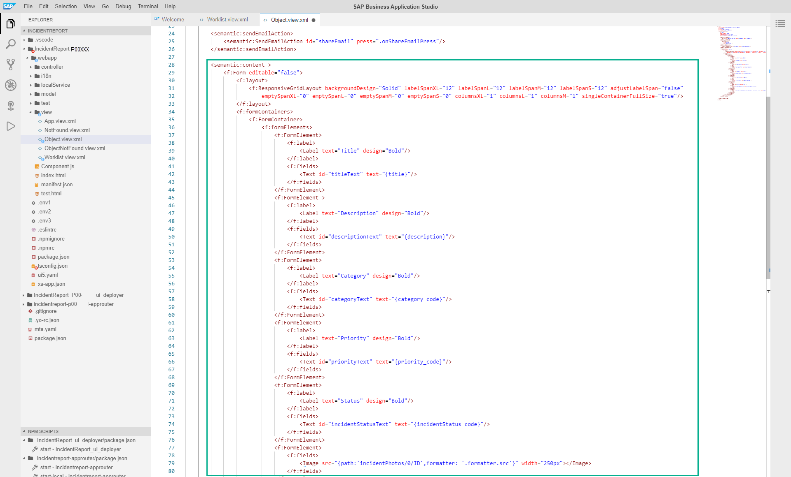

On line 79, we are adding the incident image, and we are including the parameter _formatter_. Formatter functions are used for formatting the data being rendered on various UI controls on the UI screen.


8. Open **Formatter.js** file

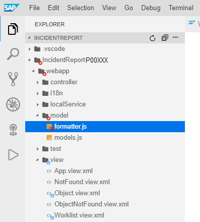

9. The _src_ formatter will convert the file name to a valid image url and the _state_ formatter will transform the *priority_code*  parameter into a valid ObjectStatus state.

```javascript
	src: function (value) {
			if (value != undefined) {
				return `/nsIncidentReportP00XXXX/master_x_incidentservice/incident/IncidentPhotos(${value})/image`;
			} else {
				return "";
			}
		},
	state: function (value) {
			if (value == "critical") {
				return "Error";
			}
			return "Success";
		}
```
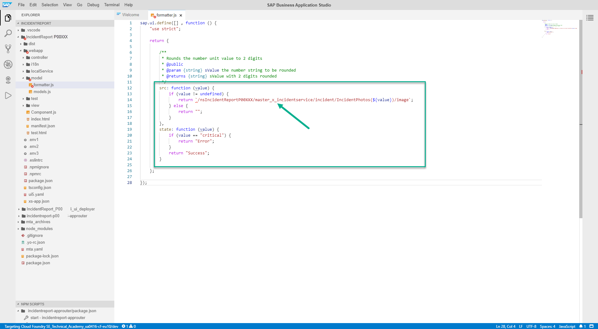

10. As you can see in Worklist View, there are some labels that haven't been set yet. This can be maintained in the _i18n.properties_ file. Open **IncidentReportP00XXXX > i18n > i18n.properties**

Note: You can create additional files to support multiple languages, you only need to attach *_(language)* at the end of the file, for instance *i18n_en.properties* or *i18n_fr.properties*

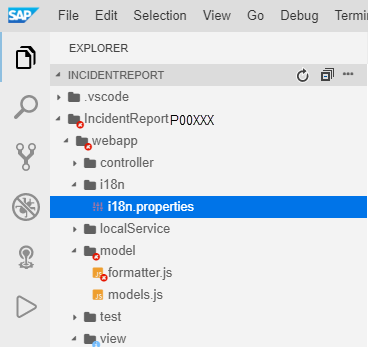

## Step 2: Create new view

You will now create a new SAPUI5 view to handle the creation of new incidents.

1. Right-click on *Create.view.xml* file and select **Open With > Code Editor** and add the code below.

On *line 2*, we specify the controller name which is a will handle the interaction with our view, *lines 3 to 8* are libraries that allow adding specific components to the view, for instance **sap.ui.layaout.form** allows us to add form components which will be used for this exercise

```xml
	<mvc:View
		controllerName="ns.IncidentReportP00XXXX.controller.Create"
		xmlns="sap.m"
		xmlns:mvc="sap.ui.core.mvc"
		xmlns:core="sap.ui.core" 
		xmlns:f="sap.ui.layout.form"
		xmlns:html="http://www.w3.org/1999/xhtml"
		xmlns:tnt="sap.tnt">
```


2. *Line 11* opens the Page tag which is the main container of our view, we set the navigation back button as enable and define a handler that we will define afterwards. 

*Lines 12 to 14* are adding a button to the view's header, this will help us to save the new incident. Similarly, we are defining a press event to the navigation button, and its corresponding function to handle it. We will discuss it in more detail later on.
```xml
	<Page showNavButton="true" navButtonPress="onNavButtonPress" title="{i18n>create}">
	<headerContent>
		<Button icon="sap-icon://save" tooltip="Save" text="Save" type="Transparent" press="onSave"/>
	</headerContent>
```
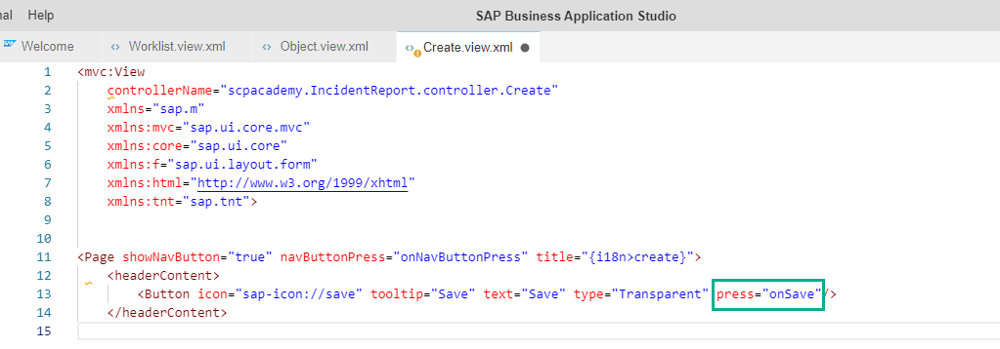


3. Let's now add the content to our view.

*Line 15* opens a content tag where we will add the content of our view. *Lines 17 to 21* describe the type of object we will include in the view, for our scenario it will be a *simple form* with some input controls.

*Lines 22 to 58* includes the different fields of our form. For open text such as title or description we will use an *Input* control. In case of fixed values, we are using a *Combo Box*. Pay attention to *line 37*, we are binding the item to a oData object *Category*, this will ensure the items we select are identical to the ones in our oData service.

```xml
		<content>
			<f:Form editable="true">
				    <f:layout>
					<f:ResponsiveGridLayout backgroundDesign="Solid" labelSpanXL="12" labelSpanL="12" labelSpanM="12" labelSpanS="12" adjustLabelSpan="false"
					    emptySpanXL="0" emptySpanL="0" emptySpanM="0" emptySpanS="0" columnsXL="1" columnsL="1" columnsM="1" singleContainerFullSize="true"/>
				    </f:layout>
				    <f:formContainers>
					<f:FormContainer>
					    <f:formElements>
						<f:FormElement label="Title">
						    <f:fields>
							<Input id="title" value="{initial>/title}" required="true" liveChange="onInput"/>
						    </f:fields>
						</f:FormElement>
						<f:FormElement label="Description">
						    <f:fields>
							<Input id="description" value="{initial>/description}" required="true" liveChange="onInput"/>
						    </f:fields>
						</f:FormElement>
						<f:FormElement label="Category">
						    <f:fields>
							<ComboBox id="category" items="{/Category}" change="onSelectionChange" selectedKey="{initial>/category_code}">
							    <core:Item key="{code}" text="{name}"/>
							</ComboBox>
						    </f:fields>
						</f:FormElement>
						<f:FormElement label="Priority">
						    <f:fields>
							<ComboBox id="priority" items="{/Priority}" change="onSelectionChange" selectedKey="{initial>/priority_code}">
							    <core:Item key="{code}" text="{name}"/>
							</ComboBox>
						    </f:fields>
						</f:FormElement>
						<f:FormElement label="Attachment">
						    <f:fields>
							<Button icon="sap-icon://camera" press="onTakePicture"></Button>
							<html:input id="file" type="file" accept="image/*" capture="camera" style="visibility: hidden"/>
							<Image  width="200px" id="picPreview"></Image>
						    </f:fields>
						</f:FormElement>
					    </f:formElements>
					</f:FormContainer>
				    </f:formContainers>
				</f:Form>
			</content>
		</Page>
	</mvc:View>
```
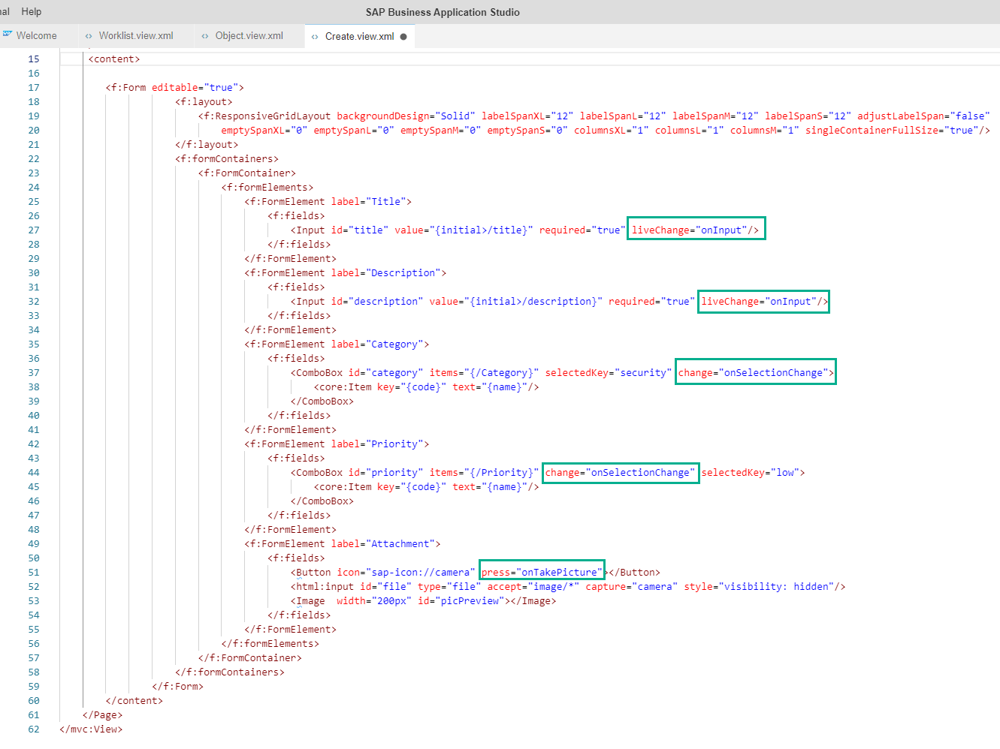

## Step 3: Create a new controller

After we created our view, we will require a new controller to handle every user interaction.

1. Open the **Create.controller.js** file and add the code below

This is the initial code for our controller. It includes some libraries *(lines 2 to 4)* and it describes the controller's name *(line 7)*

```javascript
	sap.ui.define([
		"./BaseController",
		"sap/ui/model/json/JSONModel",
		"sap/m/MessageToast"
	], function (BaseController, JSONModel,MessageToast) {
	
		return BaseController.extend("ns.IncidentReportP00XXXX.controller.Create", {
		
		});
	});
	
```
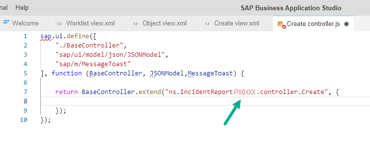

3. Right above the return sentence, we will add some global variables. They will define the initial information when a new incident is created.

```javascript
	"use strict";
	var that = null;
	var pictureObj = null;
	const initialValues = {
		title: "",
		description: "",
		category_code: "security",
		priority_code: "low",
		incidentStatus_code: "new",
		assignedIndividual_ID: "067460c5-196c-4783-9563-ede797399da8"
	};
```
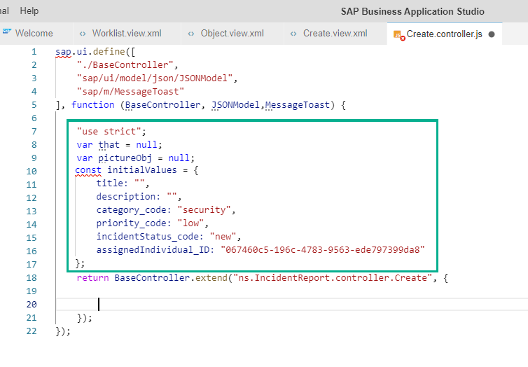

4. Within *return* clause, we will add all the functions to describe the view funtionality. The first function is called *onInit*, this is the first function to be executed when the view is loaded.

*Lines 22 to 24* create a new model with the data from our global variables and then it assigns the model to the view, we also name it *initial* to refer to it. *Line 25* is only a reference to the view, we will use it later on.

```javascript
	onInit: function () {
		
		var oModel = new JSONModel(initialValues);
		
		this.getView().setModel(oModel,"initial");
		that = this;
		
		},
```
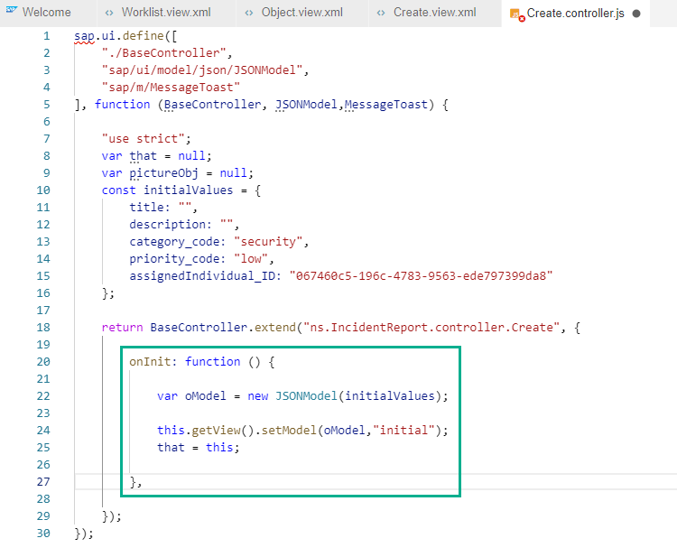

5. We will start adding event handlers. Our first event will occur when users click on *Navigation* button, the only action we want to happen is to go back to our main view.

*On line 28* we define the funtion and on *lines 29 to 31* we navigate to a *route* called worklist. This route was created by the wizard, we will discuss more about it later in this tutorial.

```javascript
	onNavButtonPress: function () {
		this.getOwnerComponent()
		    .getRouter()
		    .navTo("worklist", {});
        },
```
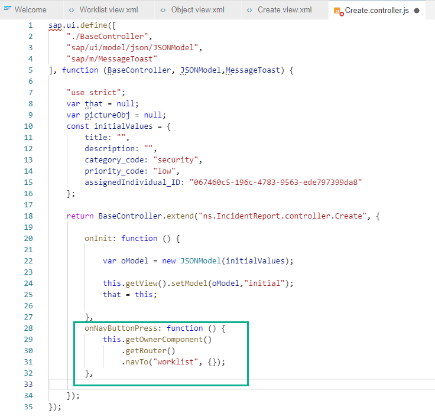

6. We want to ensure we don't get errors when saving new incidents. In order to ensure that, we will add a few functions to validate the data entered by users.

On *lines 33 to 50* we added a function that will be triggered when the value of any combo box changes and we will store the new value in the corresponding global variable *(lines 42 and 44)*

On *lines 51 to 71* is a function that will be triggered when the value of any input field changes. If data length is equal to zero, we will show an error message because we cannot have empty values.

```javascript
	onSelectionChange: function (event) {
            
			var data = that.getView().getModel("initial").getData();
			if (
				event
				.getSource()
				.getId()
				.indexOf("category") > 0
			) {
				data.category_code = event.getSource().getProperty("selectedKey");
			} else {
				data.priority_code = event.getSource().getProperty("selectedKey");
			}
			that
				.getView()
				.getModel("initial")
				.setData(data);
		}.bind(this),
		onInput: function (event) {
			var data = event.getSource().getValue();
			if (event.getSource().getId().indexOf("title") > 0) {
				if (data.length > 0) {
					this.getView().byId("title").setValueState("None");
					this.getView().byId("title").setValueStateText("");
				} else {
					this.getView().byId("title").setValueState("Error");
					this.getView().byId("title").setValueStateText("Please enter a value");
				}
			}
			if (event.getSource().getId().indexOf("description") > 0) {
				if (data.length > 0) {
					this.getView().byId("description").setValueState("None");
					this.getView().byId("description").setValueStateText("");
				} else {
					this.getView().byId("description").setValueState("Error");
					this.getView().byId("description").setValueStateText("Please enter a value");
				}
			}
        },
```
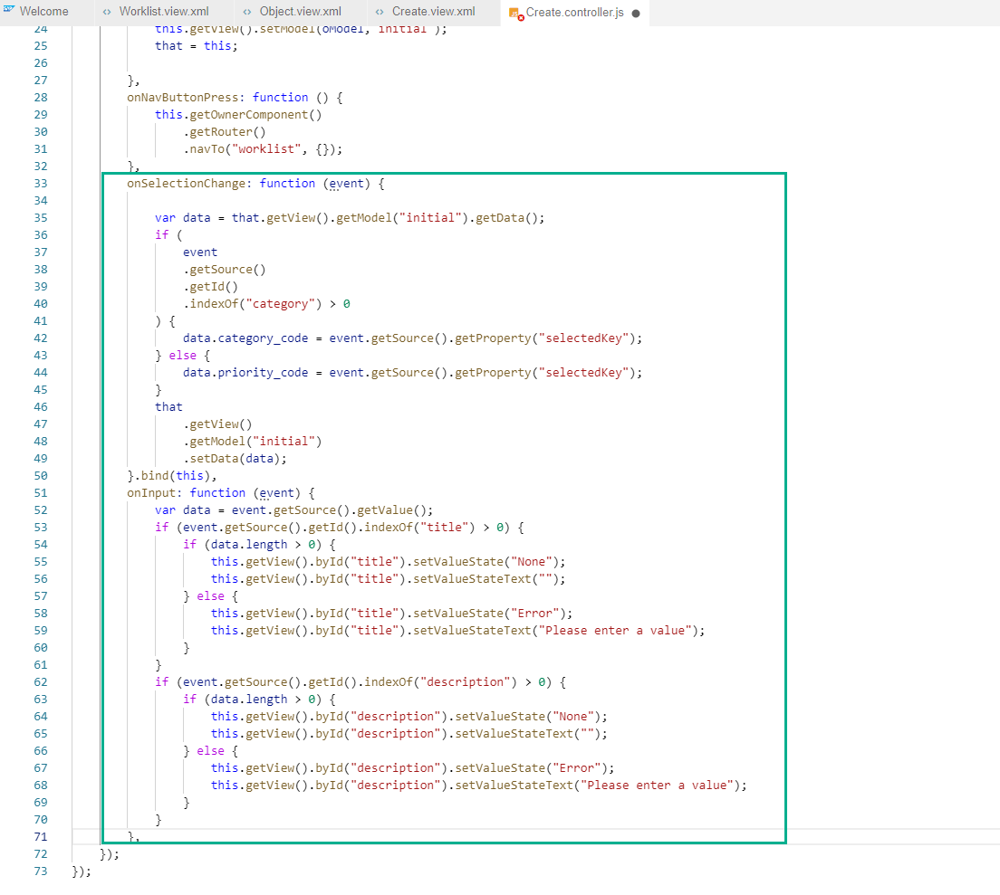

7. We will add a new function to trigger the picture uploading when the *upload* button is clicked

```javascript
	onTakePicture: function () {
			//trigger click event for the input field to open camera
			var image = document.getElementById(this.createId("file"));
			image.click();
		},
```
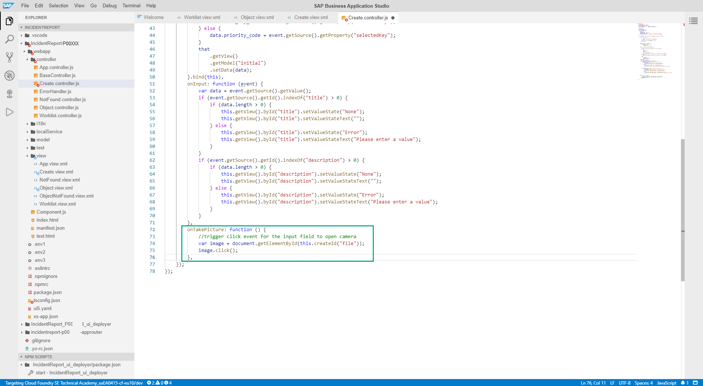

8. After a file is selected, we want to show it as a thumbnail in our view. To do so, we will add another function called *onAfterRendering* which is triggered after the view is loaded and rendered.

On *lines 80 to 82* we added a new event to the html file button. *Line 90* will update the _src_ attribute of  our image component and replace it by the new image url.

```javascript
	onAfterRendering: function () {
			var oID = this.createId("picPreview");
			//handle the event when a new picture is uploaded or a new pictures was taken using the camera
			document
				.getElementById(this.createId("file"))
				.addEventListener("change", function () {

					//check if there is an image
					if (this.files && this.files[0]) {

						var previewPic = document.getElementById(oID);
						var reader = new FileReader();
						reader.onload = function (e) {
							previewPic.src = e.target.result;
							pictureObj = e.target.result
						};

						reader.readAsDataURL(this.files[0]);

					}
				});
        },
```


9. Before saving the record in our oData service, we will carry out a last data validation.

On *lines 101 to 103* we extracted the values from our model, this values will be sent in the next step.  

```javascript
	onSave: function () {

		var data = this.getView()
			.getModel("initial")
                	.getData();
            
			if (data.title == "") {
				this.getView().byId("title").setValueState("Error");
				this.getView().byId("title").setValueStateText("Please enter a value");
			}
			if (data.description == "") {
				this.getView().byId("description").setValueState("Error");
				this.getView().byId("description").setValueStateText("Please enter a value");
			}
		},
```
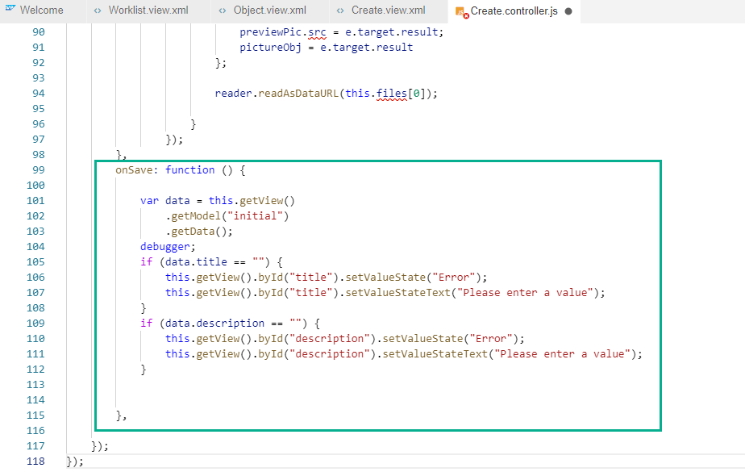

10. Right after the if sentence, where we validated that filed *description* is not empty, we will include a asynchronous call to our oData service. We will perform a POST action to create a new record.

On *lines 115 to 124* we define general setting such as _url, method, headers_. In the URL parameter *(line 117)* we are using our destination and pointing to _SafetyIncidents_ entity. The application will show a toast message with the result status.

In this function, we only created the _SafetyIncidents_ record but now we need to create 2 additional ajax calls to: 
	a. Create image metadata
	b. Upload image file

>	
	We are using standard ajax calls. If you want to know more, please go to: https://www.w3schools.com/jquery/ajax_ajax.asp

```javascript
	if (data.title != "" && data.description != "") {
				// TODO: set model to initial values
				var settings = {
					async: true,
					url: "/nsIncidentReportP00XXXX/master_x_incidentservice/incident/SafetyIncidents",
					method: "POST",
					headers: {
						"content-type": "application/json"
					},
					processData: false,
					data: JSON.stringify(data)
				};
				$.ajax(settings)
					.done(
						function (response) {

							var msg = "Incident successfully created";
							MessageToast.show(msg);
							//reset the from model to initial values to empty the fields
                            this.getView().getModel("initial").setData({
								title: "",
								description: "",
								category_code: "security",
								priority_code: "low",
								incidentStatus_code: "new",
								assignedIndividual_ID: "067460c5-196c-4783-9563-ede797399da8"
							});
							// create picture instance
							this.createPicture(response);

							//update the home page request with the new value
							//this.updateReportsModel();
							//clear picture

							//nativate back to home page
							this.getOwnerComponent()
								.getRouter()
								.navTo("worklist", {});
						}.bind(this)
					)
					.fail(function () {
						MessageToast.show("Error: Please Try Again!");
					});
			}
```
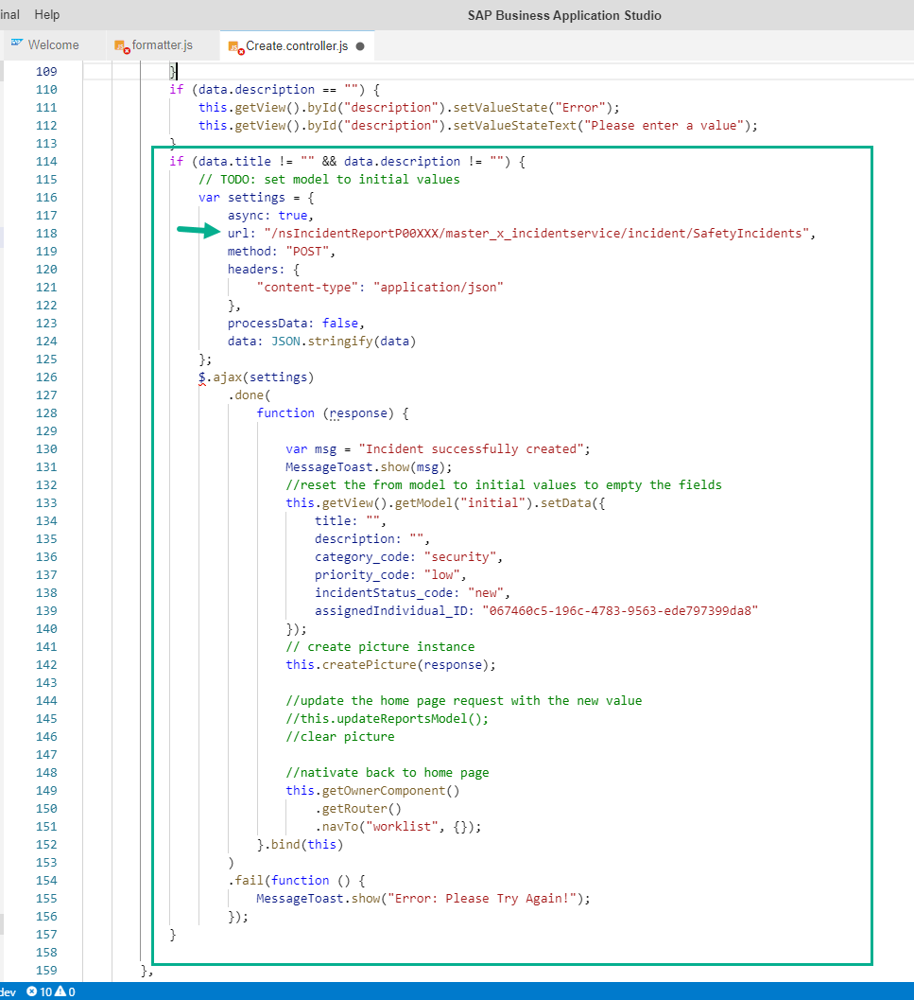

11. This step is very similar to the previous one. But in this case, we are changing the url to point to the right entity.

```javascript
	createPicture: function (response) {
			var data = {
				safetyIncident_ID: response.ID,
				imageType: "image/png"
			}
			var settings = {
				async: true,
				crossDomain: true,
				url: "/nsIncidentReportP00XXXX/master_x_incidentservice/incident/IncidentPhotos",
				"method": "POST",
				"timeout": 0,
				"headers": {
					"content-type": "application/json"
				},
				"data": JSON.stringify(data),
			};

			$.ajax(settings).done(function (response) {
                //debugger;
                if(pictureObj != null)
                    this.uploadPicture(response);
                

			}.bind(this));
        },	
```


12. We will create another ajax call to upload the image

In order to upload the picture, we first need to pre process it. This is done by calling function _dataURItoBlob_ on *line 185*.

```javascript	
	uploadPicture: function (response) {
			var id = response.ID
			var data = this.dataURItoBlob(pictureObj);

			var xhr = new XMLHttpRequest();
			xhr.withCredentials = true;

			xhr.addEventListener("readystatechange", function () {
				if (this.readyState === 4) {
					// console.log(this.responseText);
					document.getElementById(that.createId("picPreview")).src = "";
					// pictureObj = null;
					$("#" + that.createId("file")).attr("value", "");
					pictureObj = null;
				}

			});

			xhr.open("PUT", "/nsIncidentReportP00XXXX/master_x_incidentservice/incident/IncidentPhotos(" + id + ")/image");
			xhr.setRequestHeader("Content-Type", "application/x-www-form-urlencoded");

			xhr.send(data);

        },
```


13. We will create function _dataURItoBlob_ which will convert the image into a Blob object.

```javascript
	dataURItoBlob: function (dataURI) {
			var byteString;
			var mimeString;

			// separate the mimetype and byte string
			if (dataURI.split(',')[0].indexOf('base64') >= 0)
				byteString = atob(dataURI.split(',')[1]);
			else
				byteString = unescape(dataURI.split(',')[1]);

			// separate out the mime component
			mimeString = dataURI.split(',')[0].split(':')[1].split(';')[0];

			// write the bytes of the string to a typed array
			var ia = new Uint8Array(byteString.length);
			for (var i = 0; i < byteString.length; i++) {
				ia[i] = byteString.charCodeAt(i);
			}

			return new Blob([ia], {
				type: mimeString
			});
        }
```


Congratulations!. You have successfully Code Explanation Part 2.
