# Replace test service with you own service

So far, you have created a SAP UI5 Application which enables you to display and crate incidents through the app itself and via a chatbot developed on SAP Conversational AI.

Right now, those incidents are being read/created in a test service shared by all the participants, however as you remember, in week one you created your own oData service using CAP and in this section, you will replace the test service with your own.

**Before continuing with this section, you must make sure you've completed [Week 1 - CAP](../CAP/Readme.md)**

## Step 1 - Add custom logic to CAP service

In this step, you will re-open your CAP service created in week one and you will add some custom logic using NodeJS which will push a message to the Enterprise Message Queue

1. Go back to the TA Landing page and open Business Application Studio in a different tab

https://virtual-scp-roadshow.cfapps.eu10.hana.ondemand.com/


2. You should have 2 spaces running. SAP Fiori and SAP Cloud Business Application, please access to **SAP Cloud Business Application** by clicking on the space name.

> Note: The space status must be *RUNNING*, if not, click on the play button on the let hand side.


3. Right click on **srv** folder and select **New File** and name it **incidentService.js**

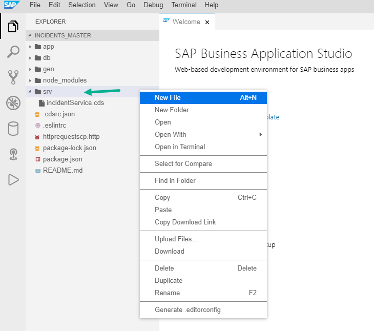

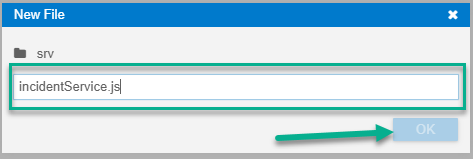

4. Open the new file and pase the code below, then go to **File > Save All**.

>
    
     module.exports = function (service) {
    // sets default priority dependending on category
    service.before('CREATE', 'SafetyIncidents', req => {
      console.log('Invoking Code as part of BEFORE custom handler')
      const incident = req.data
      //Create a payload for the message we will place on SAP Message Bus
      const user = incident.title.substring(2,9);
      const payload = {
        ID: incident.ID,
        categoryCode: incident.category_code,
        userID : user
      }
      req.on('succeeded', () => {
        console.log('Event Successfully Created', payload);
        const topic = 'sap/vr/A/SAFETYINCIDENTCREATED';
        service.emit(topic, payload);
      })
    })
    }
  
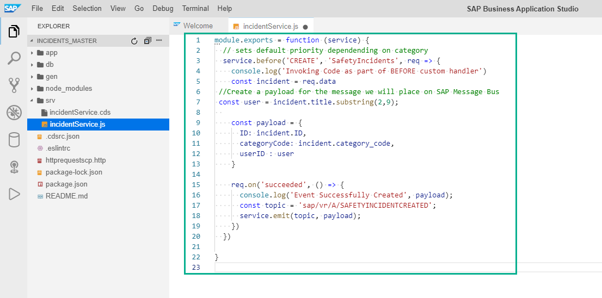


This function will be executed when a new incident is created (*line 3*). First, it will prepare a payload that includes ID, Category Code and user ID (*lines 9 - 13*) and then it will send it to the Enterprise Messaging service (*line 18*).

5. Open a new Terminal. Go to **Terminal > New Terminal**.

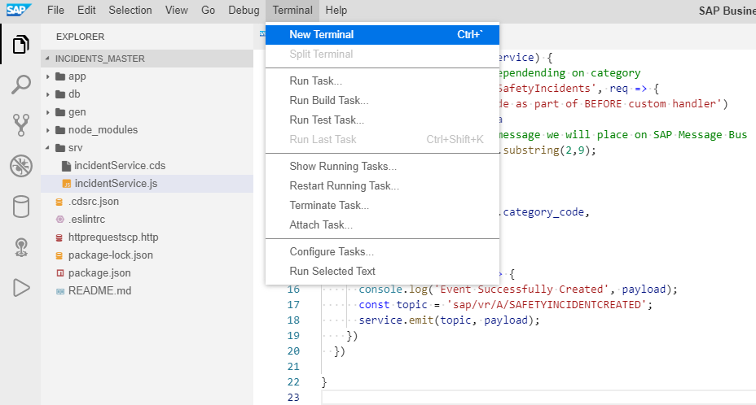

6. In the terminal, enter the following command and press **Enter**.

> export NODE_ENV=production


7. After the previous command was successfully executed, please enter the command below and press **Enter** and wait until the building process is complete.

> cds build/all --clean


8. We now need to bind our CAP service to Enterprise Messaging service. In order to do so, you will need to add a line to the **manifest.yaml**. Please go to **gen > srv** and open **manifest.yaml**, at the bottom of the file please add ```- ems``` (including the dash):

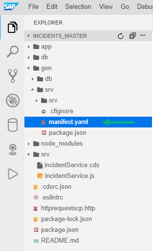

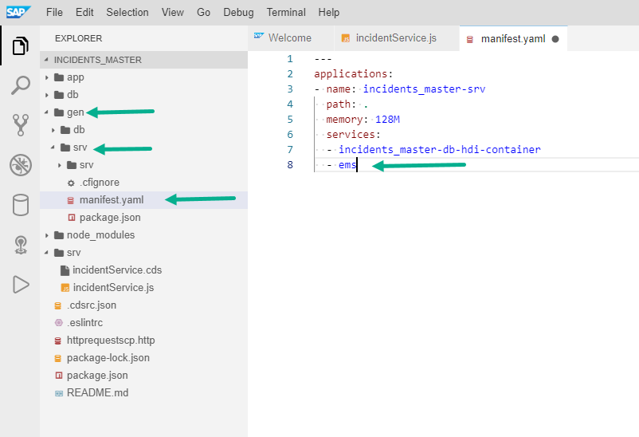

9. Finally, we will deploy the service. Please go to the **Terminal**, enter the code below and then press **Enter**.

> cf push -f gen/srv --random-route


10. When the deployment process is complete, you will see your service URL, **PLEASE WRITE IT DOWN AS YOU WILL USE IT LATER ON**

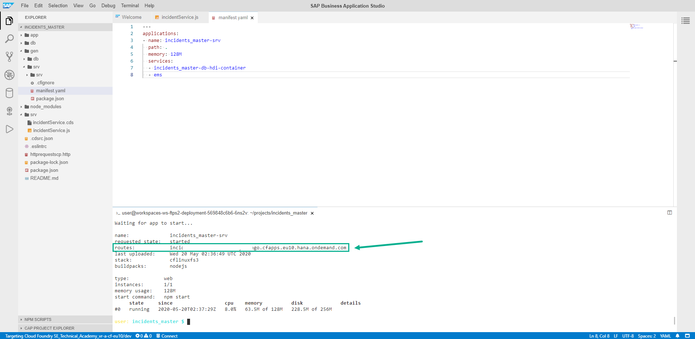

## Step 2 - Change destinations in SAP UI5 application

After our service has been modified and it's now able to push a new message to the Enterprise Messaging queue, we will change the destination in our application to point to our own.

> **IMPORTANT NOTE: To complete this step, a new destination has to be created in the SAP Cloud Platform Cockpit. The SAP team already created destinations for all the services successfully created in week 1. Before you move on, ask your instructor whether your destination is already created or not. Destinations will have the formet _P00XXXX_incidentservice_**

1. Go back to the TA Landing page and once again, open **Business Application Studio**

https://virtual-scp-roadshow.cfapps.eu10.hana.ondemand.com/


2. This time you will open your SAP Fiori Space.

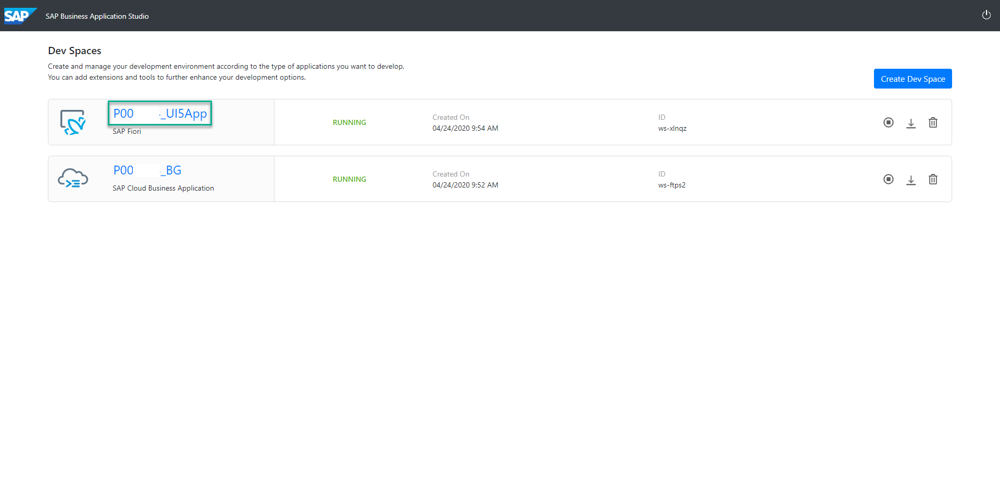

3. Go to **IncidentReportP00XXXX > webapp**, open **manifest.json** and around line 16 replace *master_x_incidentservice* with *P00XXXX_incidentservice* . **DO NOT FORGET TO REPLACE P00XXXX WITH YOUR P USER**.

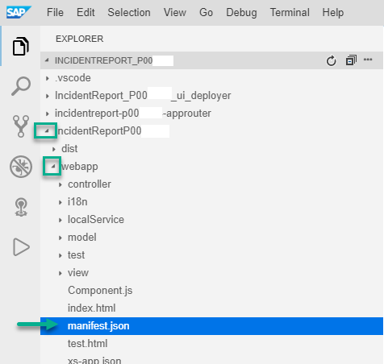


4. We will now open file **xs-app.json** under **IncidentReportP00XXXX > webapp** and around lines 8 and 9, replace *master_x_incidentservice* with *P00XXXX_incidentservice* for **source** and **destination**.


5. We will now open file **xs-app.json** under **IncidentReportP00XXXX** and around lines 8 and 9, replace *master_x_incidentservice* with *P00XXXX_incidentservice* for **source** and **destination**.


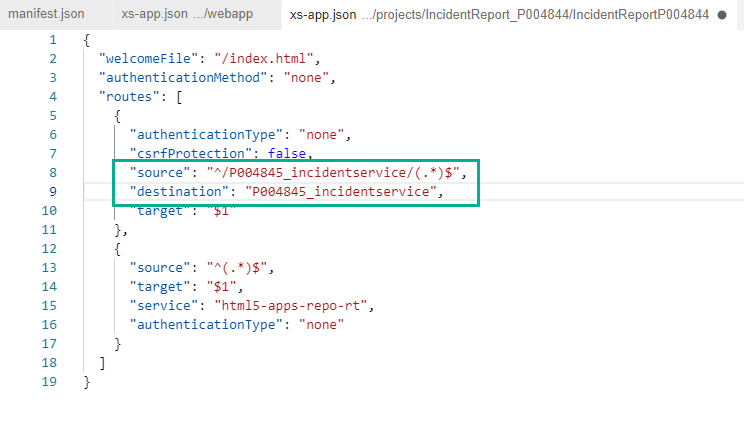

6. Now, go to **IncidentReportP00XXXX > webapp > controller** and open **Create.controller.js**.


7. In this step, we will replace every *master_x_incidentservice* with *P00XXXX_incidentservice*, 

The fastest way to do it is by pressing **Ctrl + F** and entering *master_x_incidentservice* (**DO NOT FORGET TO REPLACE x WITH YOUR TENANT ID: a, b, c or d**) in *Find* box and *P00XXXX_incidentservice* (**DO NOT FORGET TO REPLACE P00XXXX WITH YOUR P USER**) in *Replace* box, then press **Enter**.


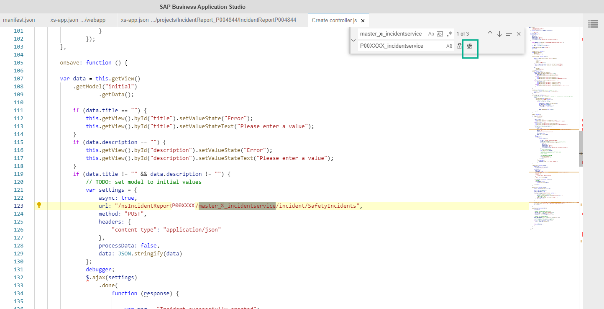

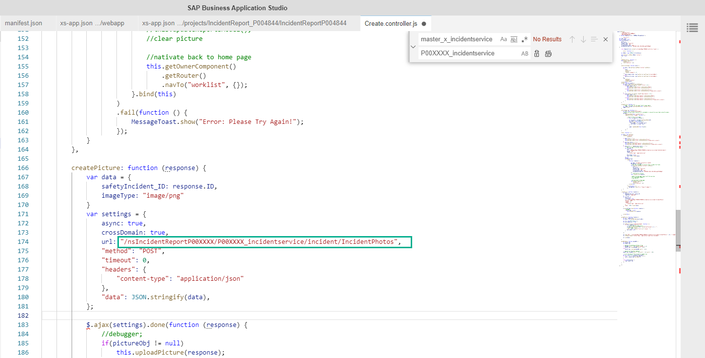

## Step 3 - Re-deploy application

1. Open a new terminal. Go to **Terminal > New Terminal**.


2. Build you application by entering the command down below (Don't forget to press **Enter**).

>   mbt build -p=cf


3. After you successfully built your poject, it's time to deploy it. Go to **mta_archives** and right click on **IncidentReport_P00XXXX_0.0.1.mtar** and click on **Deploy MTAArchive**. 

You can see that the deployment is still in progress in the Task: Deploy console at the bottom right of your screen.

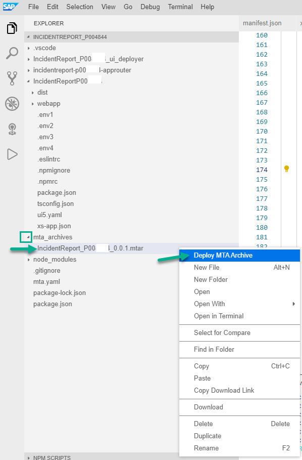

## Step 4 - Change URL in SAP Conversational AI

1. Go back to the TA Landing page and click on *Let's go!* button inside the SAP Conversational AI box. *You might need to log in again*.

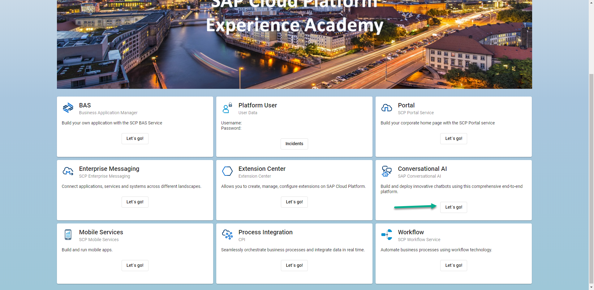

2. Once logged in, open your chatbot project and go to **Build** and open skill **queryincidents**.


3. Now that you are in skill **queryincidents**, go to **Actions** and click on the pencil next to the service URL.

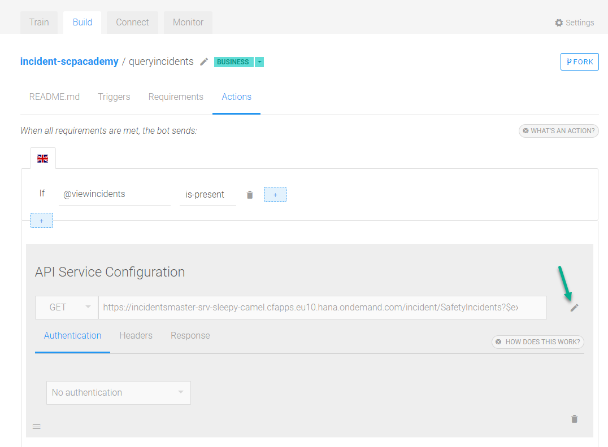

4. You will replace the *base URL* with the one you got in step 1 after deploying your service, then click **SAVE**.

> Note: _The base URL is what you will find between **https://** and **/incident/...**_.

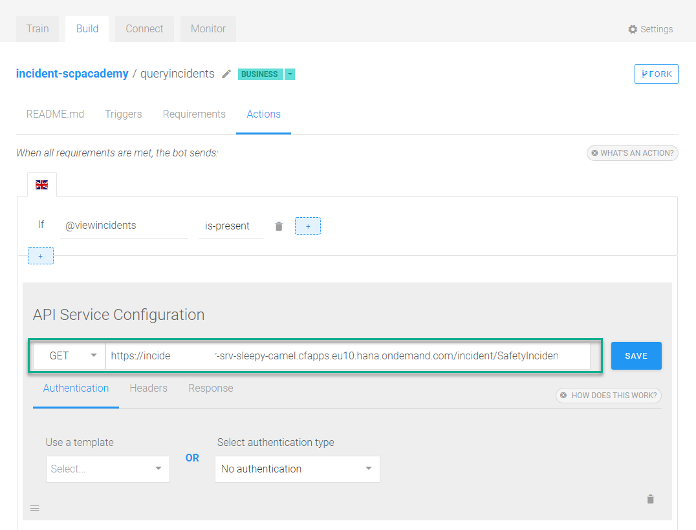

5. Go to **Headers** and replace  **Host** header with your *base URL* and then click **SAVE**

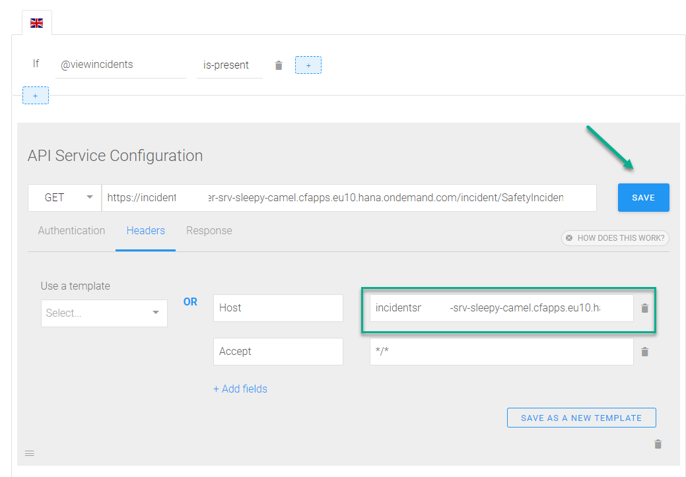

6. Scroll down until you see a list object starting with **{{api_service_response.incidents.body.value.0.title}}** and click on the *pencil*


7. You will replace the 3 *Image url* items with the values below. **Don't forget to replace YOUR BASE URL with the one you got in step 1 after deploying your service**, then click **SAVE**.

Item | URL
----------
1   |   https://YOUR BASE URL/incident/IncidentPhotos({{api_service_response.incidents.body.value.0.incidentPhotos.0.ID}})/image
2   |   https://YOUR BASE URL/incident/IncidentPhotos({{api_service_response.incidents.body.value.1.incidentPhotos.0.ID}})/image
3   |   https://YOUR BASE URL/incident/IncidentPhotos({{api_service_response.incidents.body.value.2.incidentPhotos.0.ID}})/image

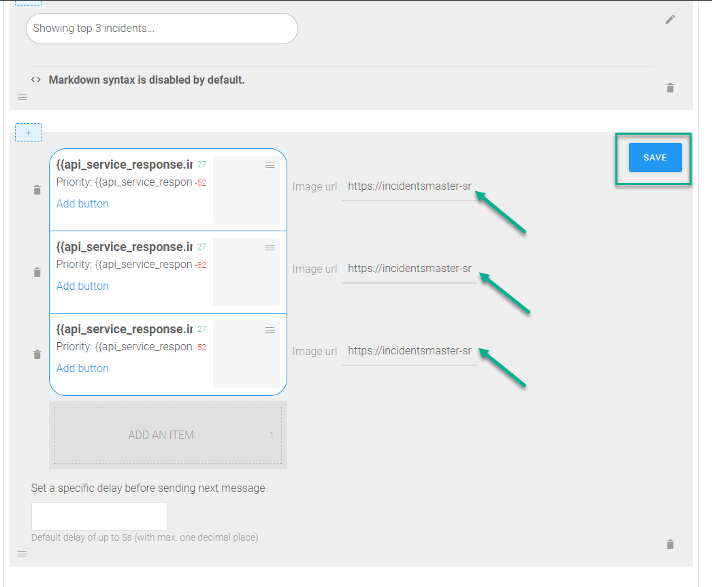

8. Go back to **Build** tab and click on skill **addtitle**.

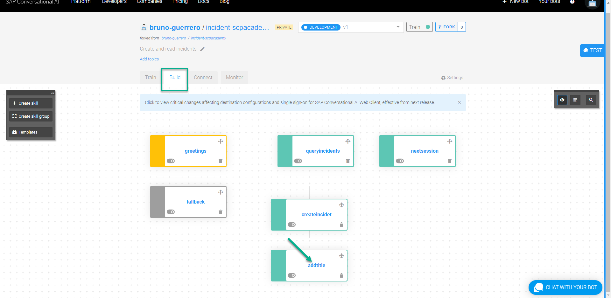

9. Go again to **Actions** tab and click on the *pencil* icon next to the two service URLs. Replace the *base URL* and **Host** header with the one you got in step 1 after deploying your service,  then click **SAVE**. 

> Note: _The base URL is what you will find between **https://** and **/incident/...**_.

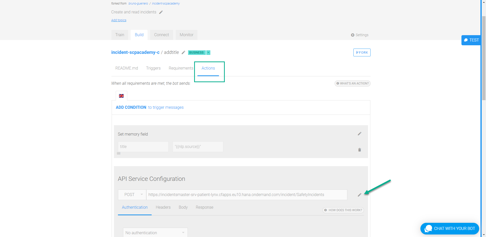

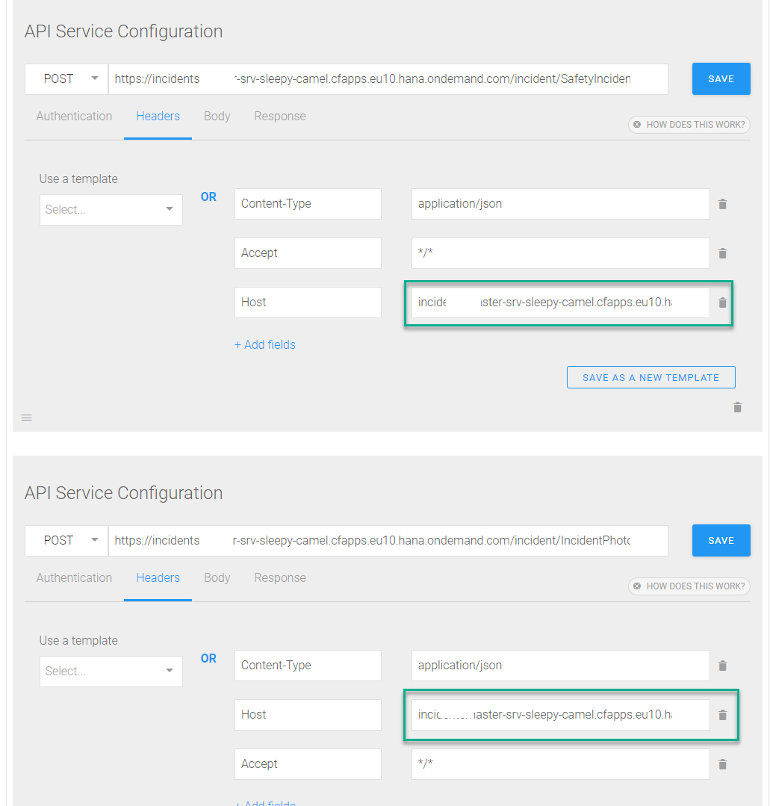


10. Re-open the app URL that you got at the end of **Part 3** and you will see the app working with your own service URL.

## Step 5 - Adjust the Workflow Destination 

As you point the different components of the Safety Incident application to your service, you will have to adjust your workflow service. 

Right-click on the following link https://virtual-scp-roadshow.cfapps.eu10.hana.ondemand.com/

Click on the "Let's Go" in the WebIDE tile.


When we look at the workflow **incidentassignment.workflow** under the incidentFlows package, there are five areas (service tasks) where you have to change the destination from **incidentservice** to **_P00XXXX_incidentservice_**. Pay attention to upper and lowercase, the changes must be entered in the correct case as described above.

### Retrieve Incident Details

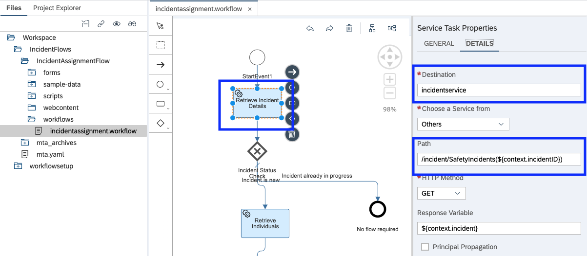

### Retrieve Individuals


### Assign Relevant Processor


### Retrieve Photo Data

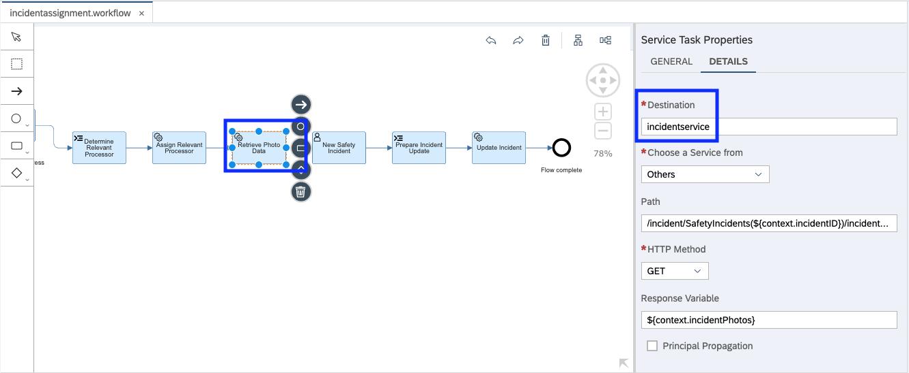

### Update Incident
  
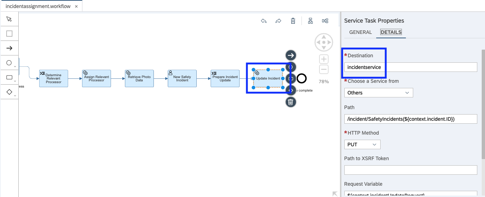 
  
## Rebuild and Deploy

Once you have made these changes, you must rebuild and deploy your changes to cloud foundry.

### Build 

Right click on the **IncidentFlows | Build | Build with Cloud MTA Build Tool** 

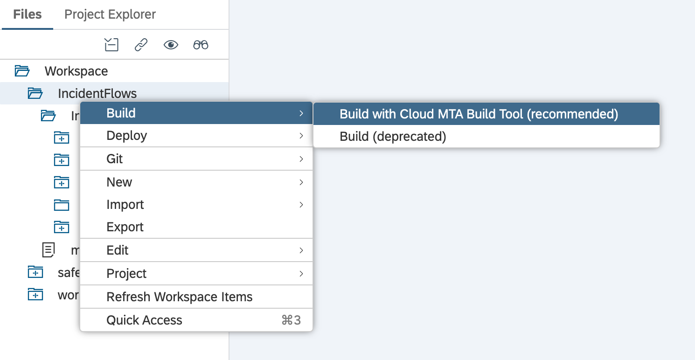 

You should now see "Build of IncidentFlows completed."


### Deploy 

Open the folder **mta_archives** 

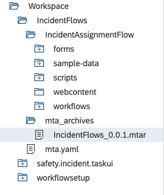 

Right click on **IncidentFlows_0.0.1.mtar | Deploy | Deploy to SAP Cloud Platform** 

 

You should now see "The IncidentFlows project has been deployed."

 

The workflow is now pointing to **your** Safety Incident Service.  

## Step 6 - Adjust your iFlow

The last step is to adjust your iFlow so that it retrieves the
information from your own CAP service.

Go back to the Landing Page
(<https://virtual-scp-roadshow.cfapps.eu10.hana.ondemand.com/>). Logon
with your P-user if requested.

Open the CPI service.


Follow the instructions from this SAP Note:
<https://launchpad.support.sap.com/#/notes/2715005>. **IMPORTANT: name your 
certificate CAPservicePXXXXXX_certif.**

Then, go to the Design page.


Open your own integration package.


Open your iFlow.


Switch to Edit mode


Select the HTTP arrow. Go to the Connection tab. Replace the Address by
the one of your own CAP service followed by
**/incident/SafetyIncidents(\${header.IncidentID})**. And replace the
Private Key Alias by the one you have just created:
**CAPservicePXXXXXX\_certif**.


Also, we need to improve the robustness of the iFlow in case an error
occurs. To do so, let's add an Exception Subprocess. From the toolbox,
choose Process and then Exception Subprocess.


Place it inside of the Integration Process.


In this case, nothing will happen in case of error. But, for sure, you can 
implement the error handling that you prefer. For instance, you could write 
the logs in a file.

Save your iFlow and then Deploy it again.


Congratulations! You have successfully completed this exercise and can use your service to generate **Safety Incidents** 
