## The Safety Incident Workflow 

In this section you will: 
  
  * Learn how to add a user interface to the Safety Incident workflow
  * Understand the Safety Incident Workflow components 
  
### Let's add a User Interface 

Click on workflow definition file **incidentassignment.workflow**. This should open the graphical editor.

Click on the white space in the editor to move the workflow up and down. 
Move the workflow so that you see the bottom three tasks.


We will be adding a "UserTask" to the workflow. On the left-hand side you will see the workflow toolbox.
Click on the task "icon" and then select "User Task"

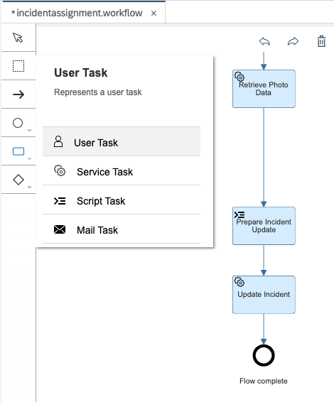

You will now have a floating blue box which you can place on the workflow. We want to place the "User Task" between the **"Retrieve Photo" task** and the **"Prepare Incident Update" task**.

When you hover over the arrow on the workflow - it will turn green - Now you can click again.

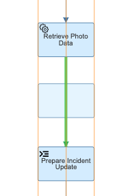

You should now see the User Task included in the workflow. It should look like the following 

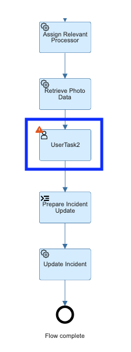

#### Configure the Properties

Click on "New Safety Incident" User Task. On the right-hand side you will see the "User Task" properties. Click on the "General" tab.

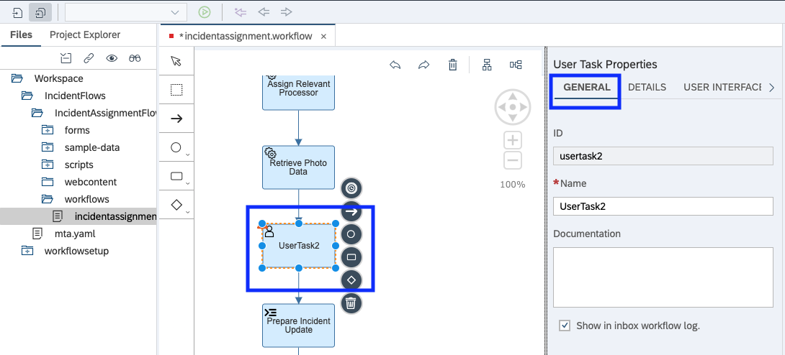

Configure the **General** tab as follows

| Name | Value | 
| ------------- | ------------- |
| Name | New Safety Incident|  
| Documentation | User task to get the assignee to work on the incident. Task will either be Confirmed (incident valid, and resolved) or Rejected (incident not valid / duplicate, and therefore closed). |  
| Show in inbox workflow log  | true |  

Now click on the **Details** tab


| Name | Value | 
| ------------- | ------------- |
| Priority | Medium|   
| Subject | ${context.incident.title} |   
| Description | Please action as appropriate. |   
| Users | P00XXXX |   

** Note: It is important that you put your P User (P00XXXX) from the course. This will be used to assign the workflow to you. If you miss this step you will not see the workflow when testing**

Now click on the **User Interface** tab

Set type to "Form" and then click on **"Create File"**

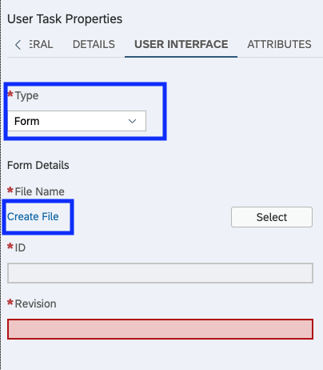

Then you will get a popup to create the UI. Fill it out as per the following image.

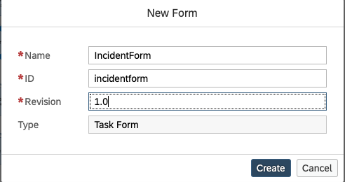

The User Interface tab will look like this.

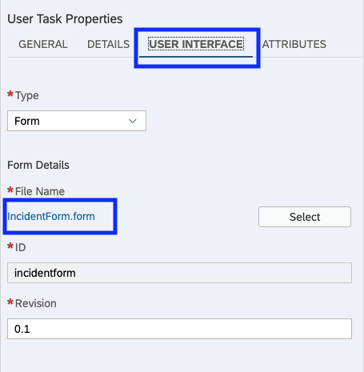

Click on the IncidentForm.form to launch the UI editor.

#### Configure the UI

Let's create the UI through configuration - no coding.

This UI will have two sections
* Basic Info
  * Title 
  * Description 
  * Category
* Notes
  * Comment
  
To design the UI, you have to open the ediotr. Double click on the file **IncidentForm.form**. It will open the editor.

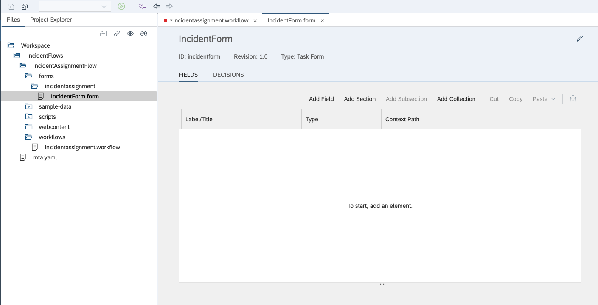

Next we will build the layout 

Use the "Add Section" button to add two sections. Give them both an title

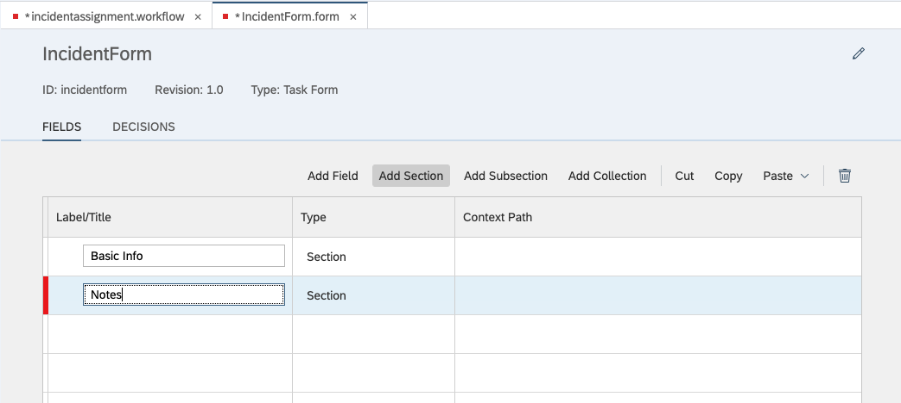

Right-click on the "Basic Info" row, and you will get an option to "add field". Select this option to add a "Title" field under the "Basic Info" section.

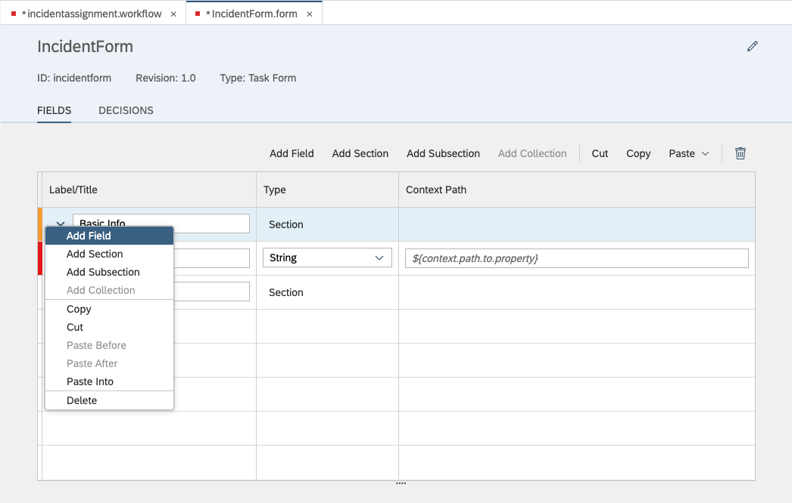

Continue to add fields till your form looks like this.

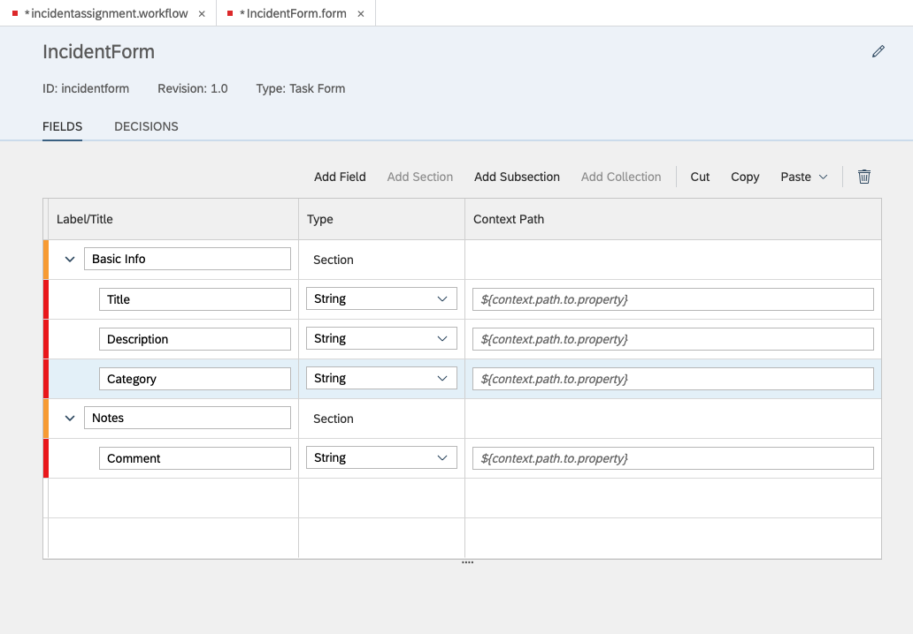

Now we will configure and bind the ui elements to the fields you have just added 
  
The configuration data for the three fields in the Basic Info section are listed below
* Click on the row to pull up the properties tab.

**Configuration for "Title"**

| Name | Value | 
| ------------- | ------------- |
| ID | title|  
| Label | Title |  
| Type | String |  
| Context Path | ${context.incident.title} | 
| Mode | Display-Only |  
| Control | Input | 

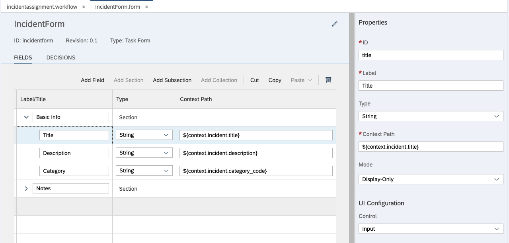

**Configuration for "Description"**

| Name | Value | 
| ------------- | ------------- |
| ID | description|  
| Label | Description |  
| Type | String |  
| Context Path | ${context.incident.description} | 
| Mode | Display-Only |  
| Control | Text Area | 
| Height | Small |  

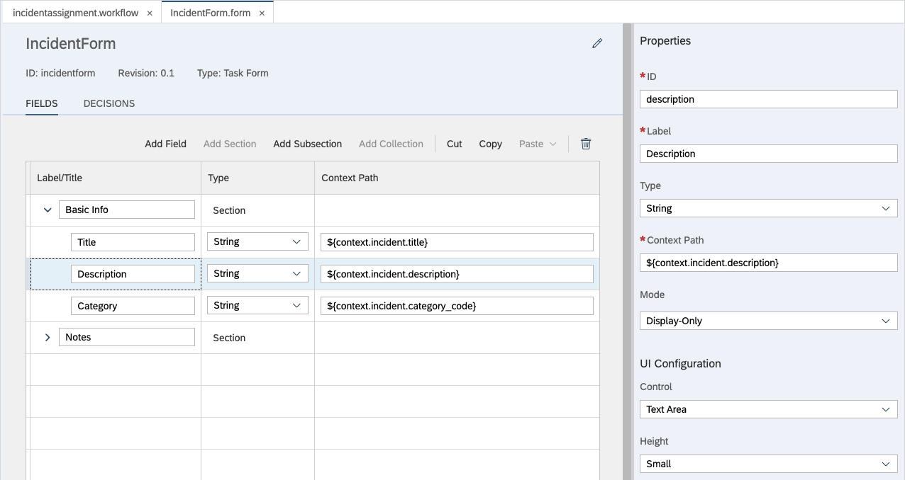

**Configuration for "Category"**

| Name | Value | 
| ------------- | ------------- |
| ID | category|  
| Label | Category |  
| Type | String |  
| Context Path | ${context.incident.category_code} | 
| Mode | Display-Only |  
| Control | Input| 


 
The configuration data for the Notes section is listed below

| Name | Value | 
| ------------- | ------------- |
| ID | comment|  
| Label | Comment |  
| Type | String |  
| Context Path | ${context.comment} | 
| Mode | Editable |  
| Required | true | 
| Control | TextArea |  
| Placeholder | Please enter your comments here  | 
| Height | Small | 

It should look like this

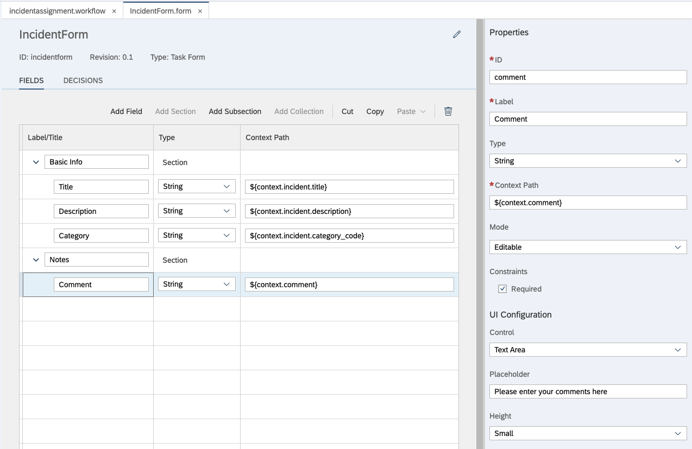

Now it is time to configure the UI decisions. The UI workflow context stores the decision the user has selected.

* Press the decision tab at the top of the screen 
**If by chance you don't see the DECISIONS tab, it might be because you have your form screen too small...try to widen it a little**


To add or delete a row press the add or trach can icons.

| Text | ID | Type | 
| ------------- | ------------- |------------- |
| Confirm | confirm |  Positive | 
| Reject | reject |  Neutral |

do not forget to **Save**

You have just added a UI to the workflow. You will see the UI when we test the workflow at the end of this session.

### The UI is Created - How does the CDS service get updated 

Now that you have created the UI, a decision will have to be taken by the safety officer. Do they **Confirm** or **Reject**.
Immediatly right after the User Task that was just created, is another task to update the service. It is called "Prepare Incident Update". 

Lets take a look to make sure it can access the results from the UI.

Double click on the file **incidentassignment.workflow**. This will open the workflow editor.

Click on the User Task that you had just added above. In my example it is called "UserTask2"
* Note : The name of your task might be different 

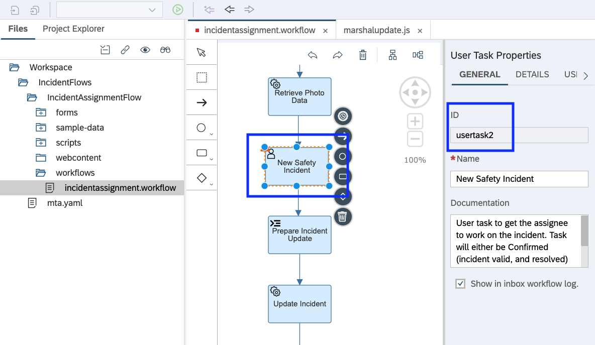

On the right-hand side, you will see the User Task Properties. On the "General" tab, note down the Task ID. 
* note: This ID is case sensitive. Copy the id. You may need it in a few minutes.

Now let's check the script task that updates the CDS service after the workflow. This task will set the status of the incident. 

Click on the "Prepare Incident Update" task. It is located right after the User task that you have just added to the workflow.

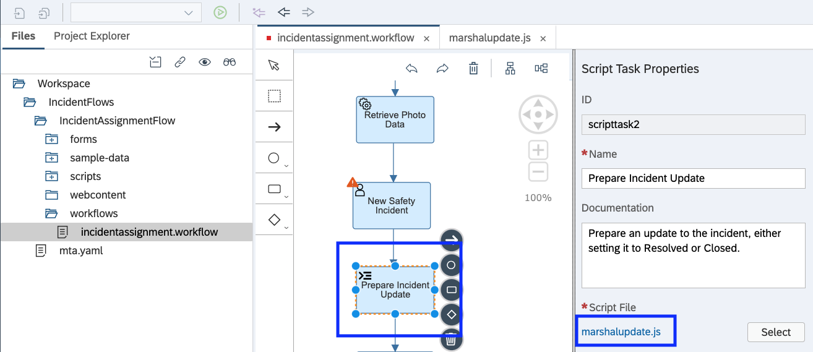

On the right-hand side, you will see the task properties. 
Click on the ***marshalupdate.js** file to open the script. 


In the first line of the script, you can see that we are checking the decision that was taken in the UI. Was it a **Confirm** or **Reject** decision.

You have to make sure that reference to the usertask ID has the same ID of your User Task that was just created. 

In my example it is "usertask2" and this matches the id from my user task, so there is nothing to change.
If it is not the same then change it to the correct id and **save** the change 

Once you update the script. You are done creating the UI.

### Identify key components of the Safety Incident Service 

The Safety Incident workflow is a collection of linked automatic or human activities that serve a certain goal. The main use case for this workflow is make safety incidents known to the safety officers in near real time and to automate the processing of these incidents. Today its Safety Incidents, tomorrow it could be to automate Employee onboarding.

Lets look at some of the key components of the Safety Incident workflow you have created.

| Task | Description | 
| ------------- | ------------- |
| User Task | A flow object that illustrates a task that a human performs. User tasks appear in My Inbox where the processor of the task can complete the task instance, and view its description. |  
| Service Task | A flow object that illustrates a system task, for example, calling an external service. |  
| Script Task | A flow object that illustrates a script that gets executed when the process execution arrives at it. | 

The Safety Incident Workflow uses all three of these tasks. 

#### Design 

The workflow will be triggered via api. Triggering the workflow via api will only take place in a future session. The API's to trigger a workflow can be found here https://api.sap.com/api/SAP_CP_Workflow_CF/resource .

When a Safety Incident is logged, the CDS service will generate a unique ID. This ID will be passed to the workflow. If the workflow requires additional data, it will call the CDS service that was created in week one (i.e. https://davidk-srv.cfapps.us10.hana.ondemand.com/)

  * You will see this in detail in part 4 when you test the workflow.

This workflow service has the ability access data that is important to the workflow from within the workflow context or by making an external call to the CDS service. The workflow tasks can access data in the context by using the following syntax ${context.incident.ID}. 
 * You have already accessed the context when you created the User Task above and bound the data to the fields on the UI. for example, in the UI when you want to access the category code you entered ${context.incident.category_code}.
 
When the Safety Incident workflow is triggered, you only have to pass in the ID. the rest is modelled by the tasks within the workflow.  
  
#### For example, how does the workflow retrieve the incident details   

In week one we created a safety incident service, which was able to create and store safety incidents. 

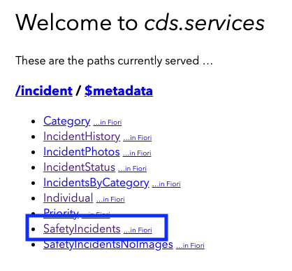

If we look at the "SafetyIncidents" service, we see that each safety incident has a unique ID and a status. Both of these fields are important for testing the workflow.


#### Start Event 

All workflows will have a start and a stop. If you click on "Start Event", on the right-hand side you will see the "Start Event Properties". This is where we configure sample data for the workflow that can be used during testing. you can see that we have already configured a file called **sample.json** and it is located under the incidentFlows package. This file must have a json format.

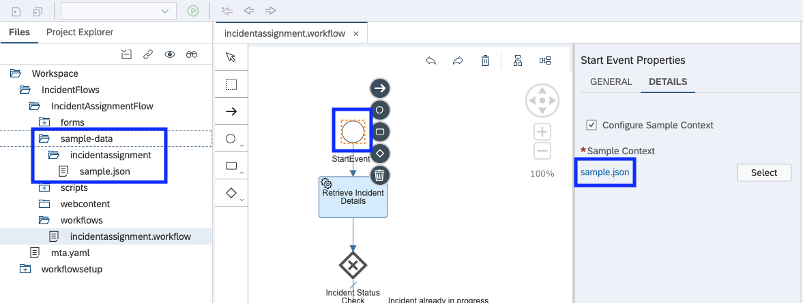

If you double click on the file sample.json you will only see the incidentID. As we move through the workflow, we will use this id to call the CDS services that was created in week one. 


#### Retrieve Incident Details - Service Task

When you click on the "Retrieve Incident Details" Service Task, you will see the properties on the right-hand side. click on the details tab. Here is where you will see the destination "incidentservice" is used.

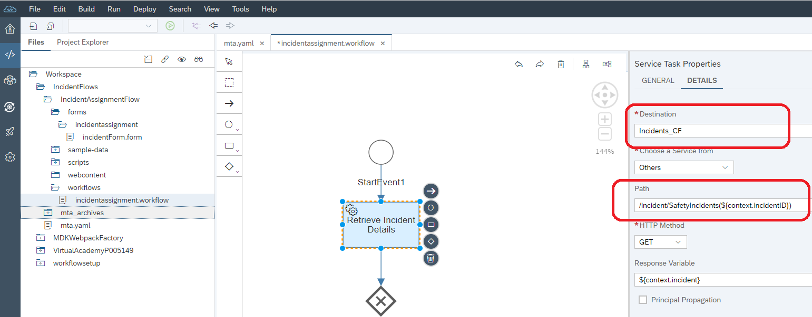

Note: The current destinations in the workflow are set to **serviceinstance** which is pointing to a test service created by SAP for this course. In a future step you will change this destination to the service that you created in the first week of this course.

```
The destination incidentservice has already been created by the SAP team for you. 

We use destinations to whitelist URL's, so that you can connect your Cloud Foundry application 
to the Internet or On-Premise  (via HTTP or RFC).

For more information refer to the following link https://help.sap.com/viewer/cca91383641e40ffbe03bdc78f00f681/Cloud/en-US/84e45e071c7646c88027fffc6a7bb787.html
```

Now lets take a look at the path in the service task properties. This path should look familiar because you have created it in week one. Click on the following link https://davidk-srv.cfapps.us10.hana.ondemand.com/ (this will eventually be replaced by your service) to see the SafetyIncidents Service that is called here.  

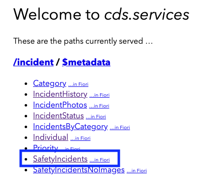

When you run the "SafetyIncidents" service, you will notice the following.

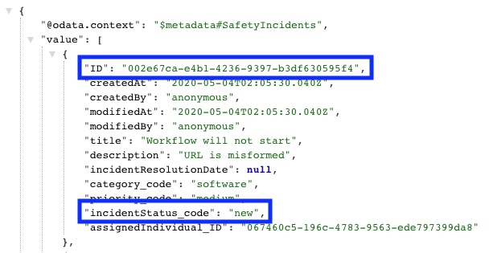

The "Retrieve Incident Details" Service Task is passing IncidentId to the CDS service "/incident/SafetyIncidents". Where did the ID come from?
 * It came from the workflow context which was populated when the workflow instance was created. 
 * If you look at the path, you will see **/incident/SafetyIncidents(${context.incidentID})** which is how we call the CDS service 
    * We use the notation **${context.incidentID}** to access the incidentID in the workflow context.
 * The context will exist as long as the workflow instance is running. 
 
The last important part of this service request is the "Response Variable". Here you can see that we are adding the SafetyIncident response to the workflow context. Once this is done, you can retrieve information from the context (For example, you can access the description of the incident using the following notation {context.incident.decription})

This is exactly how we display the description on the UI above - Take a look.

Well that's it, we did not cover each task, but you now know the high level design of the safety incident workflow and understand how they interact with the CDS service. 

[Next](Part%203%20-%20Build%20and%20Deploy.md)
