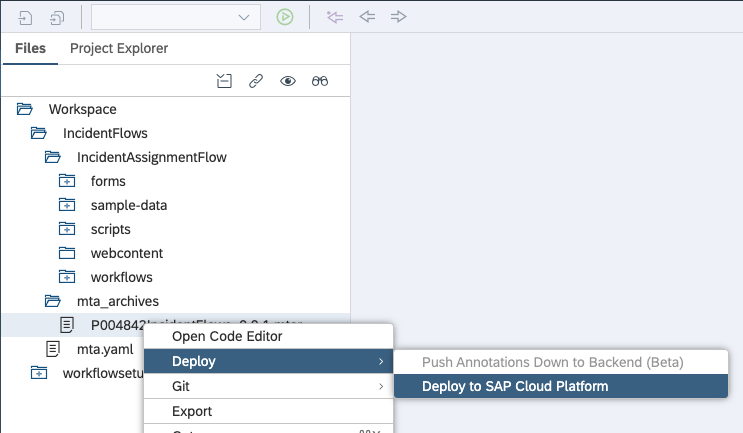

## The Safety Incident Workflow - Build and Deploy

In this section you will Build and Deploy your projects to SAP Cloud Platform. 

So far you have :
  * Configured the WedIDE to import sample projects and modify the deployment descriptors to ensure we have our own instance of the workflow.
  * Next we walked through the key areas of the workflow to understand how a workflow can call a service 
  * You then Added a form based UI to the workflow to capture comments from the security officer when the process the workflow
  * Now is the big test - we will build and deploy your workflow to SAP Cloud Platform 
  
### Build

When you build and deploy this application, new service instances will be created in your Cloud Foundry subaccount. 
**Note: It make take a few minutes for the build to complete.**

Right-click on the **IncidentFlows* project. the **Build | Build with CloudMTA Build Tool (recommended)**

You should get the following message in the console -> **Build of "IncidentFlows" completed.** 

* Take a look at the folder structure, you should see a folder called "mta_archives" which contains your archive file which will now be deployed. 

#### Step 2 : Deploy IncidentFlows

Start by deploying the IncidentFlows mtar file to SAP Cloud Platform. Right click on the MTAR file and click **Deploy to SAP Cloud Platform**. 

You will be prompted to select the subaccount and space. This is associated with your account. There should only be one.

Let the build go - it may take a few minutes. The deployment descriptors we modified previously are being used by cloud foundry to configure and deploy the required services. When the package is deployed, you will get a success message.

Congratulations, you have completed the steps to build and deploy the Safety Incident workflow. 

*LATAM*

The Fiori Launchpad which contains the access to your Inbox and Workflow Definitions can be found here:

*LATAM*
| Subaccount | User Range |  Fiori Launchpad | 
| ------------- | ------------- |------------- |
| A | P005557 - P005587 | https://se-technical-academy-xaea0554-cf-eu10-dev-master-va-wf-flp-main.cfapps.eu10.hana.ondemand.com |
| B | P005588 - P005618 | https://se-technical-academy-xaea0556-cf-eu10-dev-master-va-wf-flp-main.cfapps.eu10.hana.ondemand.com      |
| C | P005650 - P005680 | https://se-technical-academy-xaea0558-cf-eu10-dev-master-va-wf-flp-main.cfapps.eu10.hana.ondemand.com    |
Group A

https://se-technical-academy-xaea0554-cf-eu10-dev-master-va-wf-flp-main.cfapps.eu10.hana.ondemand.com

Group B

https://se-technical-academy-xaea0556-cf-eu10-dev-master-va-wf-flp-main.cfapps.eu10.hana.ondemand.com

Group C

https://se-technical-academy-xaea0558-cf-eu10-dev-master-va-wf-flp-main.cfapps.eu10.hana.ondemand.com

Once you open the Launchpad, you should be able to click on the Monitor Workflows tile and see your workflow definition if it was successfully deployed above.

[Next](Part%204%20-%20Test%20the%20Safety%20Incident%20Workflow.md)

