## Test the Safety Incident Management Workflow 

In this section you will: 
  
  * Learn how to test the Safety Incident workflow 
  * Optional: Make changes to the workflow to point to your service that you created in week one of this technical academy
  
## Test the Safety Incident Workflow 

We have created an application to help test your workflow. Access the following link on your phone, ipad or laptop 
* [Test Application](https://se-technical-academy-vr-d-cf-eu10-dev-incidentreport-approuter.cfapps.eu10.hana.ondemand.com/nsIncidentReport/index.html)

* Once you have the test application open - keep it open we will use it for testing

You should see the following application (Note: it might look different depending the device). This is a preview of what you will be building in a few weeks.


You have two options to create Safety Incidents:
* In the upper right hand corner you will see the "+" sign. 
  * Click it to create a new incident. Try to put something which will make the incident easy to find.
* In the lower right-hand corner, we have added a Conversational AI bot.
  * Click on it to activate the bot and create safety incidents.
  * For more details on the chat bot - stay tuned this will be covered in a future session
  
 ### Create Incident with the application  

You can create a new Safety Incident by pressing the + sign in the upper right hand corner of the screen.


Fill in the details and then press the save icon.

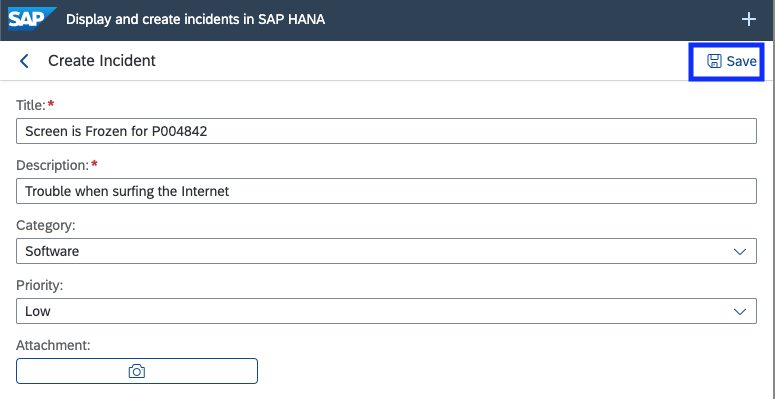

### Create incident with the Chat Bot

For the purpose of this session we have created a chat bot to create incidents. this is a preview of what you will be building in a future session. 

In the lower right-hand section of the application you will see "SAP's Digital Assistant". 
Click on the yellow bar. This will launch the chat.


You can now interact with the bot via the keyboard. Lets have the bot create an incident.

Type the following when prompted: 
* **Create Incident**
* Incident Category : **Software**
* Incident Priority : **High**
* Title : **Screen is Frozen for user P00XXXX** 

Note : 
  * Change the P00XXXX to your User ID 
  * This bot is not fully trained so there is a limited set of supported features.  This will be covered in a future session.
  
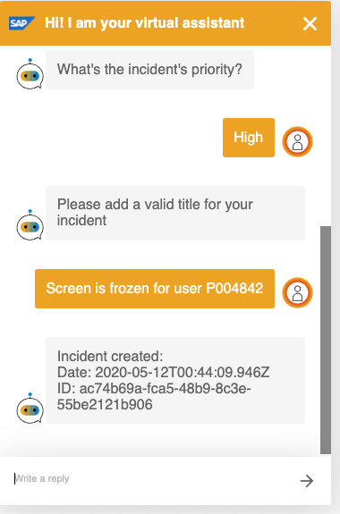

You will notice that the Bot has created the incident for you. You can see the incident ID.

### Search for Incident ID's

You can now search for the incident you just created with the app or the bot to confirm the incident was created.

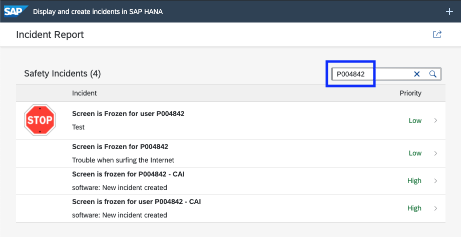

Now click on your incident to view the details. 

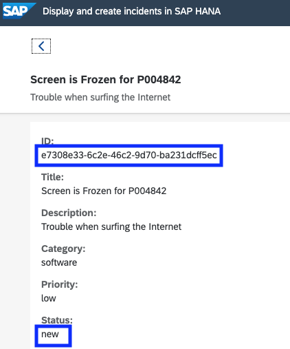

You should see the ID and the status. Both of these values are important for the workflow. 
Keep this tab open because you will reference it during testing. 

** Do not proceed if the status is not new - make sure it is your incident and the status is new.**
If there is a problem or question speak with an instructor.

**We are currently using a test CDS service deployed by SAP. In a few weeks we you be using your service that was created in week one.** 
* SAP Test Service : https://incidentsmaster-srv-sleepy-camel.cfapps.eu10.hana.ondemand.com/ 


Try the "safetyincidents" resource to find the incident that you created with the test application.


### Test the workflow

Now we are ready to test the workflow. At the end of week three this will all be automated. 

In step two you had bookmarked the portal instance that was deployed. If you do not remember the endpoint then check the console in the WebIDE or redeploy the workflow setup package. I have added the screenshot from the console where the endpoint was displayed in step two of this exercise.


The portal should look like this

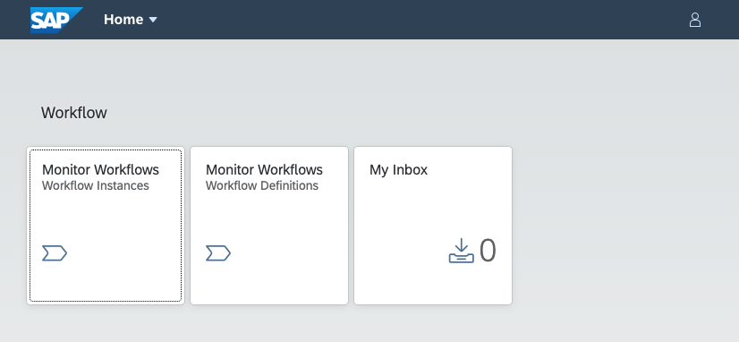

You will have three tiles
* My Inbox: This is where people will go to see their workflows 
* Workflow Definitions: This is where you will test your workflows.   
* Workflow Instances: This is where you can see the workflow details as they are executed

Note: For the purpose of this exercise we have assigned workflow admin roles to all users. Most users would only see the inbox.

Let's click on the Workflow Definitions.  

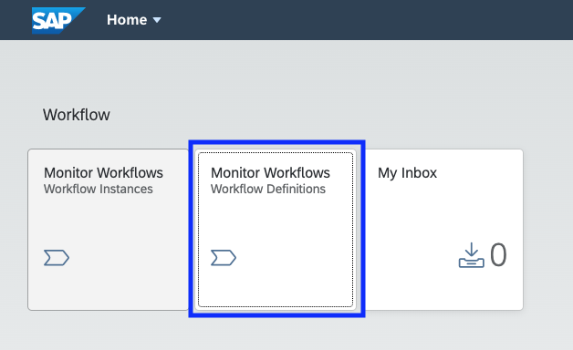

* Find your workflow definition on the left-hand side. Click it 
* Then click "New Instance" at the bottom of the screen.


* In the popup you should change the SafteyIncident ID to the ID you created above - This will add the new safety incident to the workflow context
* click "Start New Instance"
* You should get a success message

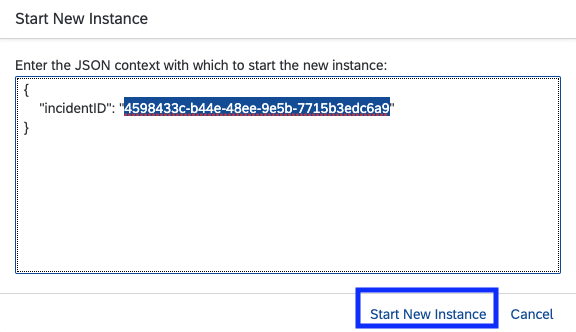

You have just created the new workflow instance. Let's take a look at the workflow.

Click on the home button. 


Next, click on the "My Inbox" tile. Notice the number has increased.

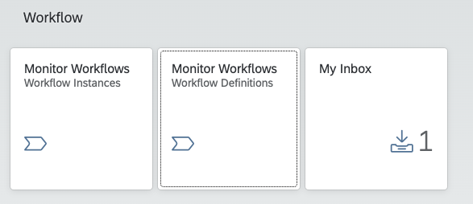

You will now see your workflow.

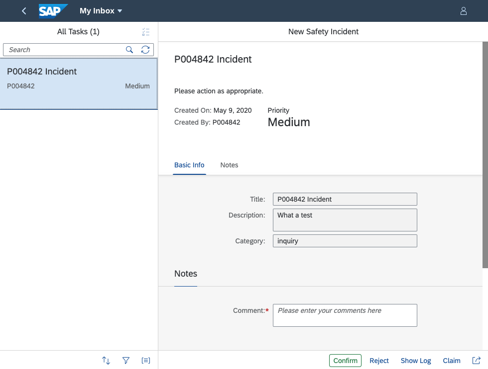

You should now see your workflow. Pay attention to the buttons at the bottom of the screen. You will see the action buttons ("Confirm", "Reject") and a button to view the workflow log. The workflow instance is now running.

**Do not press the "Confirm" or "Reject" buttons.**

```
Question: Why do you only see your workflow and not others?
```

Go back to the test application and refresh.
check the status of your incident. 
The same incident now has a status of **"assigned"**.

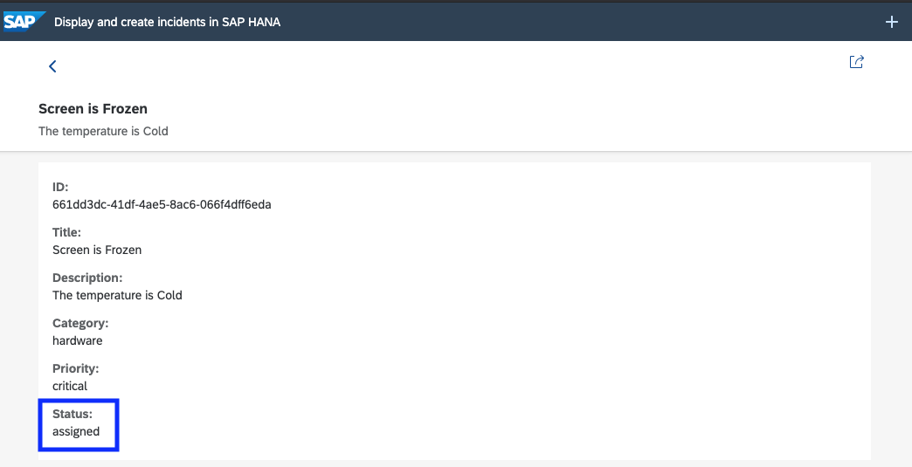

Now let's go back and accept the workflow as if you are the safety officer in your company. In-order to confirm the workflow you will have to add a comment. Try to confirm without adding a comment - you will get an error. 

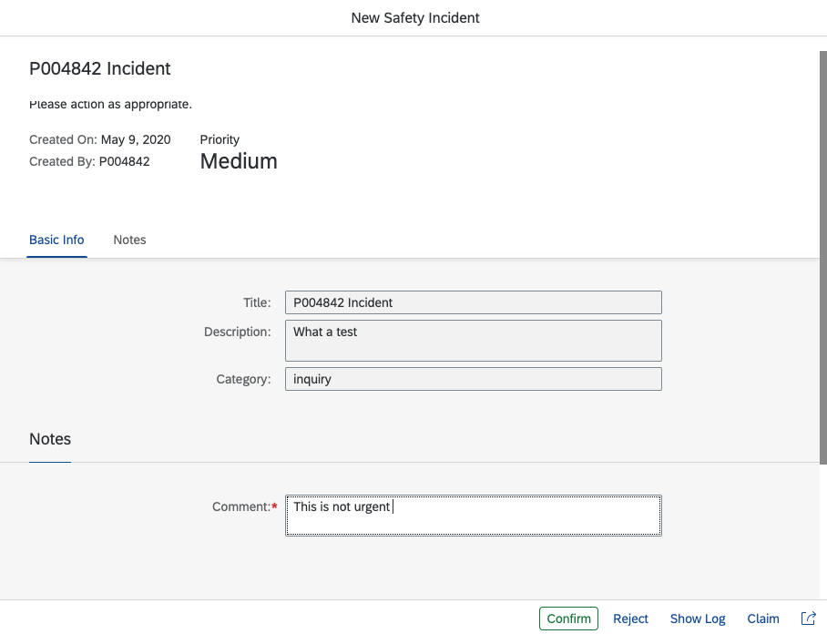

Add a comment and "Confirm" the workflow by pressing the "Confirm" button at the bottom of the Workflow UI.

Let's check the status again via the test application. 
Just refresh to see the status change. 
You can see it has been updated to show that it has been **"resolved"**.


and the last step is to go back to the inbox to see if there are more workflows to action.

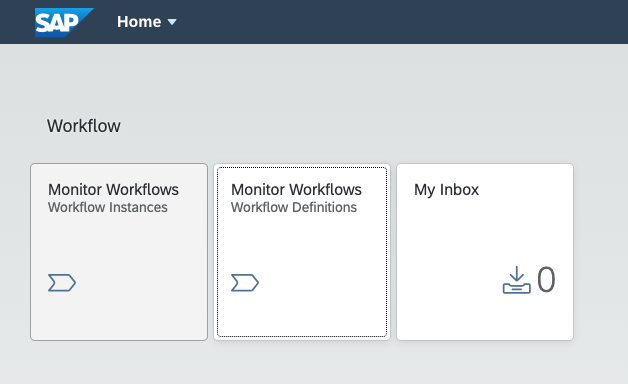

You can see that the inbox has been cleared.

Congratulations - You have successfully deployed, tested and modelled the Safety Incident Workflow and tested the workflow with your service. In the next session - next week you will be adding Enterprise Messaging to connect the CDS service with the workflow. At the end of week three you will be able to create an incident and automatically see the workflow in your inbox.

